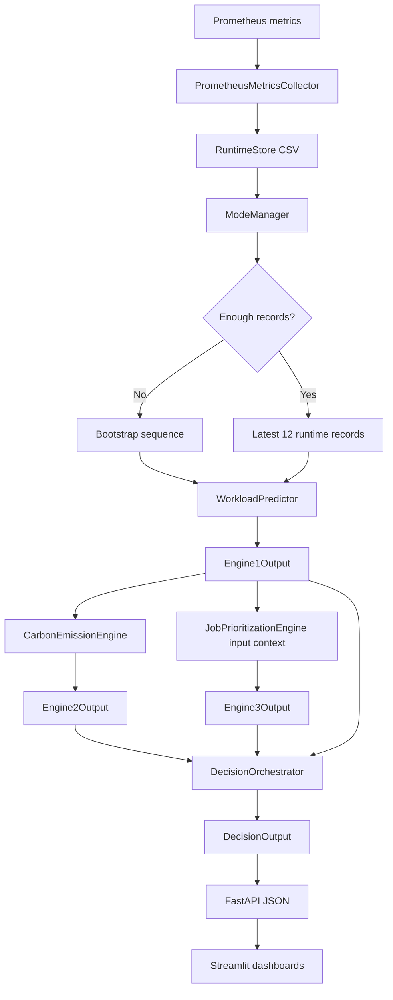
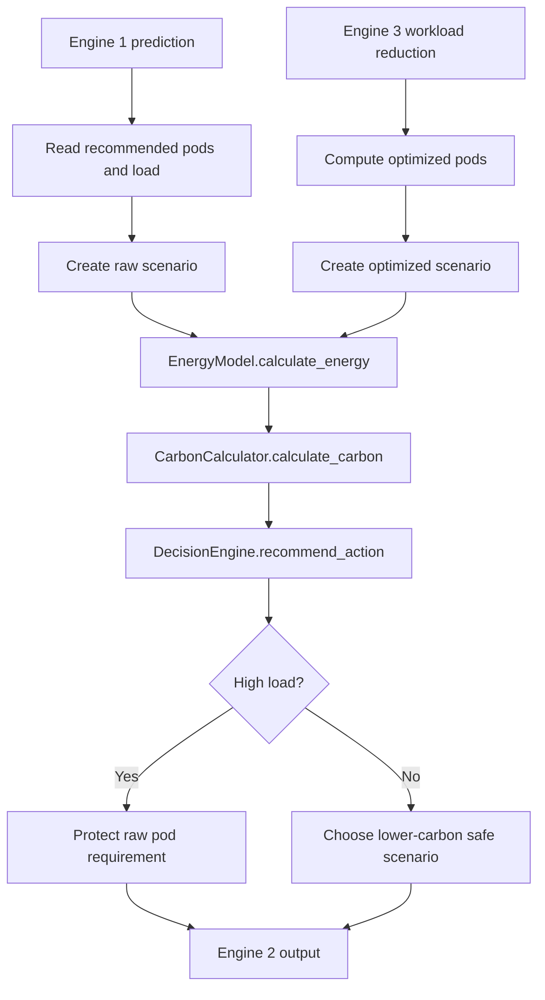
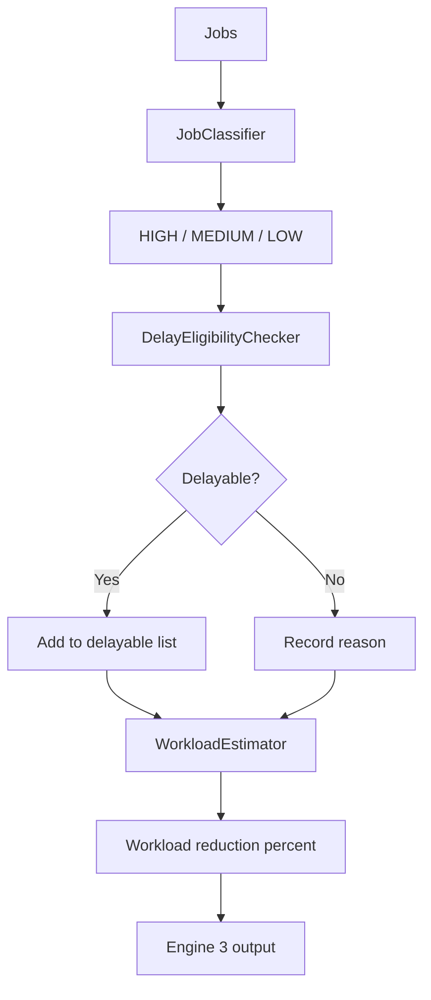
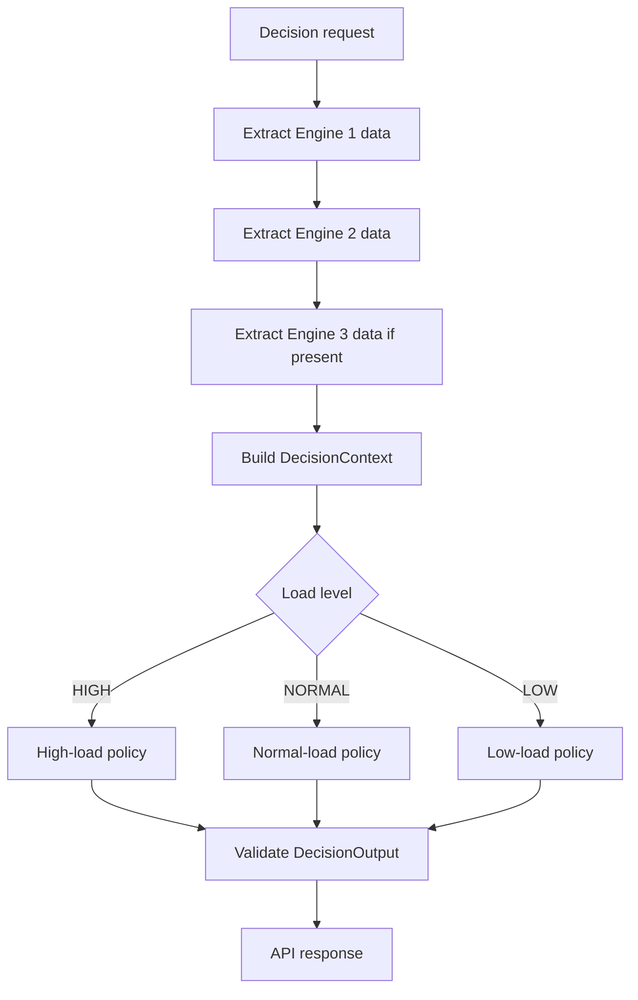
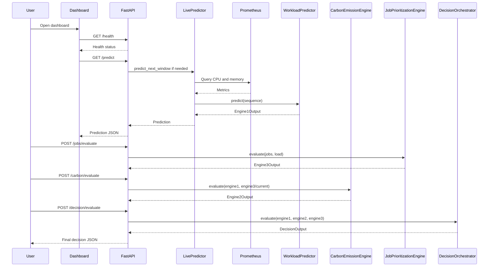

# Green DevOps Operation Phase Technical Documentation

**Research component:** Operation Phase  
**Research title:** Carbon-Aware Predictive Scaling and Job Prioritization for Sustainable Kubernetes Operations  
**Repository analyzed:** `green-devops-operation-component`  
**Documentation generated from source code only:** 2026-07-11

---

## Source-Code Boundary

This document is based only on the files present in this repository. It does not assume behavior that is not implemented or configured in the codebase.

Where the repository contains placeholders, inconsistent configuration, or missing implementation, this document states that directly. In particular:

| Topic | What the source code shows |
|---|---|
| Kubernetes scaling execution | The repository produces scaling recommendations and Kubernetes manifests, but the `src/kubernetes_integration` package is empty. No implemented code patches Kubernetes Deployments or HPAs. |
| K3s | Kubernetes YAML manifests are present, but no K3s-specific installation or runtime code was found. |
| Metrics Server | No active Metrics Server integration code was found. Runtime metrics are collected from Prometheus. |
| Grafana dashboards | Grafana provisioning files exist, but the dashboard JSON is a placeholder. The implemented dashboards are Streamlit apps. |
| Oracle Cloud tunneling/public access | No Oracle Cloud tunnel, ingress, or public-access implementation was found in code. |
| Hardware and OS | Docker and packaging files indicate Python 3.9 support, but physical server, Ubuntu version, and hardware specifications cannot be determined from code. |
| API module path in Docker/Makefile | Docker, Compose, and Makefile reference `src.api.main:app`, but no `src/api/main.py` implementation exists. The implemented FastAPI app is created by `src/workload_prediction_engine/api.py` and started by `scripts/run_live_api.py`. |

---

# 1. Executive Summary

The Operation Phase project implements a research prototype for sustainable Kubernetes operations. Its main objective is to predict short-term workload demand, estimate the carbon impact of scaling choices, identify jobs that can safely be delayed, and produce a final runtime decision such as scaling up, scaling down, maintaining current capacity, delaying jobs, or using a hybrid action.

The implemented system contains four main decision stages:

1. **Workload Prediction Engine**  
   Implemented in `src/workload_prediction_engine`. It uses a PyTorch LSTM model to predict CPU workload for the next 30-second window from a 12-step sequence of CPU and memory observations.

2. **Carbon Emission Engine**  
   Implemented in `src/carbon_engine`. It estimates energy and carbon emissions for raw and optimized scaling scenarios using configurable constants such as energy per pod-hour and carbon intensity.

3. **Job Prioritization Engine**  
   Implemented in `src/job_prioritization_engine`. It classifies jobs as high, medium, or low priority and determines which jobs may be delayed under current load, deadline, backlog, and delay-history constraints.

4. **Decision Layer**  
   Implemented in `src/decision_layer`. It combines workload prediction, carbon evaluation, job prioritization, and current pod count into a final operation recommendation.

The project also includes:

- A FastAPI service exposing prediction, carbon, job, and decision endpoints.
- Streamlit dashboards for overview and technical monitoring.
- Dataset preparation and LSTM training scripts.
- Kubernetes manifests, Helm templates, Docker files, and monitoring configuration.
- Runtime CSV storage for metrics, predictions, and demo history.
- Validation and demo scripts for system-level testing.

The strongest implementation theme is a staged architecture: each engine has a clear input/output contract and can be validated independently. The main research contribution expressed in code is the integration of predictive scaling, carbon-aware evaluation, and job deferral logic into a single operation-phase decision pipeline.

The most important implementation gap is that Kubernetes receives recommendations only indirectly through API output and demo state. No active Kubernetes client code applies the final decision to a live Deployment.

---

# 2. System Overview

## 2.1 Project Purpose

The project exists to support the Operation Phase of a Green DevOps research workflow. The operation phase is the part of a software delivery lifecycle where deployed workloads run continuously and must be monitored, scaled, and optimized.

The codebase addresses this problem:

> How can a Kubernetes-based system reduce unnecessary carbon emissions while preserving service-level performance?

The implemented answer is a multi-engine runtime decision system:

- Predict upcoming CPU load.
- Estimate the pod count needed for that predicted load.
- Evaluate the carbon cost of running those pods.
- Inspect pending or simulated jobs.
- Delay non-critical work when safe.
- Produce a final operation decision.

## 2.2 Problem Being Solved

Traditional autoscaling normally reacts to current CPU or memory usage. This repository attempts to improve that behavior in three ways:

1. **Predictive scaling instead of only reactive scaling**  
   The LSTM model predicts the next workload window before the system reaches a high-load state.

2. **Carbon-aware operation**  
   Scaling choices are evaluated in terms of estimated energy and carbon emissions.

3. **Job-aware optimization**  
   If some workload is delayable, the system can reduce immediate resource pressure without violating high-priority job constraints.

## 2.3 Overall System Objective

The system objective is to produce an operation recommendation for Kubernetes workloads:

```text
runtime metrics + model prediction + carbon estimate + job priority data + current pods
    -> final action
    -> final recommended pod count
    -> jobs to delay
    -> carbon saving estimate
    -> SLA preservation status
```

## 2.4 Expected Outputs

The implemented system can produce the following outputs:

| Output | Produced by | Storage/API location |
|---|---|---|
| Predicted CPU percentage | `WorkloadPredictor.predict` | `GET /predict`, `GET /predict/run`, CSV in `data/predictions` |
| Predicted load level | `WorkloadPredictor._classify_load` | API response and prediction CSV |
| Recommended pods from Engine 1 | `WorkloadPredictor._estimate_pods` | API response and prediction CSV |
| Raw and optimized carbon scenarios | `CarbonEmissionEngine.evaluate` | `POST /carbon/evaluate` |
| Delayable jobs and workload reduction | `JobPrioritizationEngine.evaluate` | `POST /jobs/evaluate` |
| Final action and final pods | `DecisionOrchestrator.evaluate` | `POST /decision/evaluate` |
| Dashboard visualizations | Streamlit apps | `dashboard/app.py`, `dashboard/technical_app.py`, `dashboard/unified_app.py` |
| Demo loop history | Demo scripts | `data/demo/history.csv`, `data/demo/latest.json` |

## 2.5 Key Innovations Present in Code

| Innovation | Code evidence |
|---|---|
| LSTM-based predictive scaling | `src/workload_prediction_engine/model.py`, `src/workload_prediction_engine/predictor.py` |
| Cold-start handling | `src/workload_prediction_engine/bootstrap.py`, `src/workload_prediction_engine/mode_manager.py` |
| Runtime metrics persistence | `src/workload_prediction_engine/runtime_store.py` |
| Carbon-aware scenario simulation | `src/carbon_engine/scenario_simulator.py` |
| SLA-protected high-load decision logic | `src/carbon_engine/decision_engine.py`, `src/decision_layer/policy_rules.py` |
| Job deferral under constraints | `src/job_prioritization_engine/job_classifier.py`, `src/job_prioritization_engine/delay_checker.py`, `src/job_prioritization_engine/workload_estimator.py` |
| End-to-end decision orchestration | `src/decision_layer/decision_orchestrator.py` |
| Live API plus background prediction loop | `scripts/run_live_api.py` |
| Streamlit operation dashboards | `dashboard/app.py`, `dashboard/technical_app.py`, `dashboard/unified_app.py` |

---

# 3. Folder Structure Analysis

## 3.1 Top-Level Repository Structure

| Folder/File | Purpose | Main responsibilities |
|---|---|---|
| `config/` | YAML configuration files | Default, dev, prod, carbon, scaling, SLA, and job policy settings. Some values are not actively consumed by the main engines. |
| `dashboard/` | Streamlit dashboard apps | User-facing overview dashboard, technical dashboard, unified dashboard launcher, and demo data adapter. |
| `data/` | Datasets and runtime data | Public raw workload dataset, processed CSVs, preprocessed LSTM arrays, runtime metrics, predictions, demo data, and analysis files. |
| `docs/` | Documentation | Existing project docs plus this generated technical documentation. |
| `experiments/` | Experiment configuration | Experiment metadata and tracking-related files. |
| `infrastructure/` | Deployment infrastructure | Kubernetes manifests, Docker files, Helm chart, Terraform placeholders. |
| `logs/` | Runtime logs | API and validation log files, including rotating `engine1_api_*` logs. |
| `models/` | Trained model artifacts | PyTorch `.pt` LSTM models under `models/trained`. |
| `monitoring/` | Prometheus and Grafana configuration | Prometheus scrape configuration and placeholder Grafana/alert files. |
| `notebooks/` | Research notebook area | Contains notebook-related file(s). |
| `scripts/` | Training, preprocessing, demo, validation, and runtime scripts | Dataset preparation, model training, API startup, demo loops, system validation. |
| `src/` | Main source code | Prediction, carbon, job prioritization, decision layer, shared utilities, and placeholder packages. |
| `tests/` | Pytest test package | Contains `conftest.py` and README. No active `test_*.py` files were found under this folder. |
| `tmp_dashboard_qa/` | Generated dashboard QA artifacts | Temporary screenshots/profile data from dashboard QA. |
| `requirements.txt` | Python dependencies | FastAPI, PyTorch, TensorFlow, pandas, scikit-learn, Kubernetes client, testing and tooling packages. |
| `setup.py` | Package metadata | Package name, version, install requirements, Python version. |
| `pyproject.toml` | Tooling configuration | Black, mypy, and pytest configuration. |
| `Makefile` | Developer commands | Install, test, lint, train, run API/dashboard, Docker commands. Some commands reference a missing API module. |
| `.env.example` | Environment variable template | Prometheus URL, API port, model paths, retraining/logging settings. |

## 3.2 `config/`

### Purpose

The `config/` directory centralizes YAML configuration for deployment environments and domain-specific policy values.

### Files

| File | Purpose |
|---|---|
| `default.yaml` | Default operation-phase configuration. |
| `dev.yaml` | Development overrides. |
| `prod.yaml` | Production overrides. |
| `carbon_config.yaml` | Carbon estimation parameters and thresholds. |
| `scaling_config.yaml` | Scaling thresholds and predictive scaling options. |
| `sla_config.yaml` | SLA constraints and job patterns. |
| `job_policies.yaml` | Job priority categories and delay policies. |

### Responsibilities

- Provide environment-level settings such as namespace, Prometheus URL, API host/port, and logging.
- Define policy values for carbon estimation, scaling, SLA limits, and job delay constraints.
- Provide a higher-level configuration model than the engine-specific Python constants.

### Dependencies

The shared loader in `src/shared/config.py` can read these files. However, the active engines often use Python constants from their own `config.py` files instead:

- `src/workload_prediction_engine/config.py`
- `src/carbon_engine/config.py`
- `src/job_prioritization_engine/config.py`
- `src/decision_layer/config.py`

This means YAML configuration and active runtime configuration are partly duplicated.

## 3.3 `dashboard/`

### Purpose

The dashboard folder implements Streamlit interfaces for monitoring and demonstration.

### Files

| File | Purpose |
|---|---|
| `app.py` | Level 1 overview dashboard. |
| `technical_app.py` | Level 2 technical dashboard. |
| `unified_app.py` | Single Streamlit app that switches between overview and technical dashboards. |
| `demo_adapter.py` | Reads demo JSON/CSV files and adapts them for dashboard display. |
| `requirements.txt` | Streamlit dashboard-specific dependencies. |

### Responsibilities

- Poll the FastAPI backend.
- Display workload predictions.
- Display scaling recommendations.
- Display live/demo pipeline state.
- Display runtime history from CSV files.
- Provide a non-code interface for demonstrations and supervisor review.

### Dependencies

- `streamlit`
- `streamlit-autorefresh`
- `requests`
- `pandas`
- `plotly`
- Runtime files under `data/demo`, `data/runtime_metrics`, and `data/predictions`.
- API endpoints served by `scripts/run_live_api.py`.

## 3.4 `data/`

### Purpose

The data folder stores raw public workload traces, processed datasets, preprocessed LSTM arrays, runtime metrics, predictions, and demo outputs.

### Major Subfolders and Files

| Path | Purpose |
|---|---|
| `data/public_datasets/fastStorage/2013-8` | Raw workload CSV files from the fastStorage dataset folder. |
| `data/processed/workload_data.csv` | Combined workload dataset generated from raw CSV files. |
| `data/preprocessed/global` | Per-system/global LSTM sequence arrays and scalers. |
| `data/preprocessed/full_dataset` | Larger full-dataset sequence arrays and scaler. |
| `data/preprocessed/balanced_dataset` | Active balanced dataset used by the configured predictor. |
| `data/runtime_metrics` | Runtime CSV files written by `RuntimeStore`. |
| `data/predictions` | Prediction CSV files written by `RuntimeStore.append_prediction`. |
| `data/demo` | Latest demo state and demo history. |

### Responsibilities

- Store training inputs and model-preparation artifacts.
- Store runtime metrics used for cold-start transition and retraining.
- Store prediction history used by dashboards.
- Store demo loop outputs.

## 3.5 `scripts/`

### Purpose

The scripts directory contains operational entry points, dataset preparation, model training, validation, dashboard QA, and demo workflows.

### Important Scripts

| Script | Purpose |
|---|---|
| `run_live_api.py` | Starts the FastAPI app and background prediction loop. |
| `run_live_engine1.py` | Runs Engine 1 prediction loop without the full API service. |
| `run_demo_loop.py` | Runs an end-to-end loop against live API endpoints. |
| `run_demo_scenarios.py` | Sends predefined scenarios through the system. |
| `combine_workload_datasets.py` | Combines raw workload CSV files into `data/processed/workload_data.csv`. |
| `prepare_lstm_sequences.py` | Builds 12-step LSTM sequences from processed data. |
| `prepare_full_dataset.py` | Builds full-dataset train/test arrays. |
| `prepare_balanced_full_dataset.py` | Builds the active balanced dataset. |
| `train_full_lstm_model.py` | Trains a PyTorch LSTM on the full dataset. |
| `retrain_lstm_model.py` | Trains the active balanced PyTorch LSTM model. |
| `validate_balanced_model.py` | Validates the active balanced model behavior. |
| `test_engine1.py`, `test_full_system.py`, etc. | Script-level validation utilities. |

## 3.6 `src/`

### Purpose

The `src/` folder contains the main application logic.

### Main Packages

| Package | Purpose |
|---|---|
| `src/workload_prediction_engine` | Engine 1: workload prediction, runtime collection, cold start, model inference, API. |
| `src/carbon_engine` | Engine 2: energy/carbon estimation and carbon-aware action recommendation. |
| `src/job_prioritization_engine` | Engine 3: job classification, delay eligibility, workload reduction. |
| `src/decision_layer` | Final decision engine combining outputs from Engines 1, 2, and 3. |
| `src/shared` | Shared schemas, config loader, logging, constants, utilities, exceptions. |
| `src/api` | Placeholder package. No implemented `main.py` was found. |
| `src/kubernetes_integration` | Placeholder package. No active Kubernetes client implementation was found. |
| `src/metrics_layer`, `src/data_layer`, `src/background_jobs`, `src/carbon_emission_engine`, `src/decision_engine` | Placeholder packages with no active implementation beyond package files. |

## 3.7 `infrastructure/`

### Purpose

Contains deployment artifacts for containers and Kubernetes-style deployment.

### Major Areas

| Path | Purpose |
|---|---|
| `infrastructure/k8s_manifests` | Namespace, Deployment, Service, ConfigMap, RBAC YAML. |
| `infrastructure/docker` | Dockerfile and Docker Compose file. |
| `infrastructure/helm` | Helm chart and templates. |
| `infrastructure/terraform` | Placeholder Terraform structure. |

### Important Limitation

The deployment files reference endpoints and module paths that are not fully implemented:

- Docker/Compose/Makefile reference `src.api.main:app`, but the active app is built by `src/workload_prediction_engine/api.py`.
- Kubernetes readiness probe calls `/ready`, but the FastAPI implementation exposes `/health` and not `/ready`.
- Prometheus scrape config targets `/metrics`, but the FastAPI implementation does not define a Prometheus `/metrics` endpoint.

## 3.8 `monitoring/`

### Purpose

Contains Prometheus and Grafana configuration.

### Files

| File | Purpose |
|---|---|
| `monitoring/prometheus/prometheus.yml` | Prometheus scrape configuration. |
| `monitoring/prometheus/alert_rules.yml` | Placeholder alert rules. |
| `monitoring/grafana/provisioning/datasources.yaml` | Grafana datasource placeholder. |
| `monitoring/grafana/dashboards/overview.json` | Placeholder dashboard content. |

---

# 4. Complete System Architecture

## 4.1 Main Runtime Architecture

The system is organized around a set of engines connected through API endpoints and demo/dashboard consumers.

```text
                 +-----------------------------+
                 | Kubernetes / workload pods  |
                 +--------------+--------------+
                                |
                                | metrics scraped by Prometheus
                                v
                 +-----------------------------+
                 | Prometheus                  |
                 | /api/v1/query               |
                 | /api/v1/query_range         |
                 +--------------+--------------+
                                |
                                v
                 +-----------------------------+
                 | LivePredictor               |
                 | metrics collection          |
                 | RuntimeStore CSV persistence|
                 | cold/runtime mode selection |
                 +--------------+--------------+
                                |
                                v
                 +-----------------------------+
                 | Engine 1                    |
                 | LSTM Workload Predictor     |
                 | predicted CPU/load/pods     |
                 +--------------+--------------+
                                |
              +-----------------+------------------+
              |                                    |
              v                                    v
+-----------------------------+       +-----------------------------+
| Engine 2                    |       | Engine 3                    |
| CarbonEmissionEngine        |       | JobPrioritizationEngine     |
| energy/carbon scenarios     |       | delayable job analysis      |
+--------------+--------------+       +--------------+--------------+
               |                                     |
               +------------------+------------------+
                                  |
                                  v
                    +-----------------------------+
                    | Decision Layer              |
                    | DecisionOrchestrator        |
                    | final action/final pods     |
                    +--------------+--------------+
                                  |
          +-----------------------+-----------------------+
          |                                               |
          v                                               v
+----------------------+                      +----------------------+
| FastAPI responses    |                      | Streamlit dashboards |
| JSON endpoints       |                      | overview/technical   |
+----------------------+                      +----------------------+
```

## 4.2 Component Communication

| Component | Communicates with | Mechanism |
|---|---|---|
| `scripts/run_live_api.py` | FastAPI app | Creates app using `create_api_app` and runs `uvicorn`. |
| `LivePredictor` | Prometheus | HTTP requests to Prometheus API. |
| `LivePredictor` | `RuntimeStore` | Python method calls and CSV file writes. |
| `LivePredictor` | `WorkloadPredictor` | Python method call `predict_next_window -> predictor.predict`. |
| FastAPI `/carbon/evaluate` | `CarbonEmissionEngine` | Lazy import and Python method call. |
| FastAPI `/jobs/evaluate` | `JobPrioritizationEngine` | Lazy import and Python method call. |
| FastAPI `/decision/evaluate` | `DecisionOrchestrator` | Lazy import and Python method call. |
| Streamlit dashboards | FastAPI | HTTP requests using `requests`. |
| Demo scripts | FastAPI | HTTP GET/POST requests. |
| Kubernetes | System | Manifests exist, but no active scaling client code applies decisions. |

## 4.3 Runtime Startup

The implemented runtime startup path is:

```text
scripts/run_live_api.py
    -> parse CLI arguments
    -> setup logging
    -> validate workload prediction config
    -> create LivePredictor
    -> initialize CarbonEmissionEngine if import succeeds
    -> create FastAPI app with create_api_app
    -> start background prediction thread
    -> run uvicorn server
```

The background loop:

```text
run_prediction_loop
    -> live_predictor.predict_next_window()
    -> update api_instance.last_prediction
    -> sleep interval seconds
```

Default CLI values in `scripts/run_live_api.py` include:

| Argument | Default |
|---|---|
| `--prometheus-url` | `http://localhost:9090` |
| `--port` | `8000` |
| `--host` | `0.0.0.0` |
| `--interval` | `30` seconds |
| `--bootstrap-strategy` | `forward_fill` |

The `--system-id` argument is required.

## 4.4 Data Flow



## 4.5 Runtime Decisions

Runtime decisions are produced by the decision layer, not directly by the LSTM.

The LSTM produces:

- predicted CPU
- load level
- recommended pods

The carbon engine produces:

- raw scenario
- optimized scenario
- carbon saving
- recommended action

The job priority engine produces:

- delayable job list
- workload reduction percentage
- delay reason

The decision layer produces:

- final action
- final required pods
- jobs to delay
- SLA preservation flag
- safety notes
- reason

---

# 5. End-to-End Workflow

## 5.1 Complete Runtime Workflow

```text
Application Startup
    |
    v
Configuration validation
    |
    v
LivePredictor initialization
    |
    v
Runtime metrics collection
    |
    v
Cold-start or runtime sequence preparation
    |
    v
LSTM prediction
    |
    v
Carbon evaluation
    |
    v
Job prioritization
    |
    v
Decision orchestration
    |
    v
FastAPI response
    |
    v
Dashboard visualization
    |
    v
Kubernetes recommendation
```

## 5.2 Stage 1: Application Startup

The primary live startup script is `scripts/run_live_api.py`.

Responsibilities:

- Parse CLI arguments.
- Configure console and rotating file logging.
- Validate Engine 1 configuration through `validate_config`.
- Create `LivePredictor`.
- Create `CarbonEmissionEngine` when available.
- Create the FastAPI app using `create_api_app`.
- Start the background prediction loop.
- Start the Uvicorn server.

Important code objects:

- `setup_logging`
- `run_prediction_loop`
- `main`
- `LivePredictor`
- `create_api_app`

## 5.3 Stage 2: Configuration

Runtime configuration comes from multiple locations:

| Source | Used for |
|---|---|
| CLI arguments in `scripts/run_live_api.py` | system ID, Prometheus URL, API host/port, interval, mock mode. |
| `src/workload_prediction_engine/config.py` | active Engine 1 constants such as sequence length, model path, scaler path. |
| `src/carbon_engine/config.py` | active Engine 2 constants. |
| `src/job_prioritization_engine/config.py` | active Engine 3 constants. |
| `src/decision_layer/config.py` | active decision-layer thresholds and policies. |
| YAML files in `config/` | shared/high-level configuration, partly not wired into active engines. |
| `.env.example` | environment variable template. |

## 5.4 Stage 3: Runtime Metrics Collection

Runtime metrics are collected by `PrometheusMetricsCollector` in `src/workload_prediction_engine/metrics_collector.py`.

Prometheus health check:

```text
GET {prometheus_url}/-/healthy
```

Latest metrics endpoint:

```text
GET {prometheus_url}/api/v1/query
```

Range metrics endpoint:

```text
GET {prometheus_url}/api/v1/query_range
```

The implemented latest metric queries are:

```text
container_cpu_usage_seconds_total{pod="<system_id>"}
container_memory_usage_bytes{pod="<system_id>"}
```

Important limitation: CPU usage is queried as a raw cumulative counter. The code does not use a PromQL `rate(...)` expression in the active query.

## 5.5 Stage 4: Prediction

Prediction is performed by:

- `LivePredictor.predict_next_window`
- `WorkloadPredictor.predict`
- `LSTMWorkloadPredictor.forward`

The runtime sequence must have shape:

```text
(12, 2)
```

The two features are:

1. CPU
2. Memory

The configured prediction window is:

```text
30 seconds
```

## 5.6 Stage 5: Carbon Engine

The carbon engine receives Engine 1 prediction output and optional Engine 3 workload reduction output.

It calculates:

- raw scaling energy
- raw scaling carbon
- optimized scaling energy
- optimized scaling carbon
- carbon saving
- recommended carbon-aware action

Implemented formulas:

```text
energy_kwh = pod_count * ENERGY_PER_POD_KWH_PER_HOUR * (time_window_seconds / 3600)

carbon_gco2 = energy_kwh * CARBON_INTENSITY_GCO2_PER_KWH
```

## 5.7 Stage 6: Job Priority

The job priority engine classifies jobs into:

- HIGH
- MEDIUM
- LOW

It decides whether each job can be delayed based on:

- priority
- job type
- explicit priority
- deadline
- already delayed time
- backlog size
- current load level
- estimated CPU

## 5.8 Stage 7: Decision Engine

The decision layer combines:

- Engine 1 predicted load and raw pod recommendation
- Engine 2 raw and optimized carbon scenarios
- Engine 3 delayable jobs
- current pod count

Then it applies load-specific policies:

- high-load policy
- normal-load policy
- low-load policy

## 5.9 Stage 8: API

The API exposes:

- health
- current prediction
- manual prediction
- runtime metrics
- system status
- carbon evaluation
- job evaluation
- decision evaluation

Implemented in:

```text
src/workload_prediction_engine/api.py
```

## 5.10 Stage 9: Dashboard

The dashboards call API endpoints and read CSV/JSON files:

- `dashboard/app.py`
- `dashboard/technical_app.py`
- `dashboard/unified_app.py`
- `dashboard/demo_adapter.py`

The dashboards refresh automatically using `streamlit-autorefresh`.

## 5.11 Stage 10: Kubernetes Recommendation

The final output contains a recommended action and final pod count. The repository includes Kubernetes Deployment, Service, namespace, ConfigMap, and RBAC files.

However, the source code does not include an implemented Kubernetes client that applies the recommendation to a live Deployment.

---

# 6. Technical Architecture

## 6.1 Engine-Based Architecture

The project is best understood as four cooperating engines.

| Engine | Package | Responsibility |
|---|---|---|
| Engine 1 | `src/workload_prediction_engine` | Predict workload and recommend raw pods. |
| Engine 2 | `src/carbon_engine` | Estimate energy/carbon and carbon-aware scaling scenario. |
| Engine 3 | `src/job_prioritization_engine` | Identify delayable jobs and workload reduction. |
| Decision Layer | `src/decision_layer` | Produce final operation decision. |

## 6.2 Engine 1 Files

| File | Main classes/functions | Purpose |
|---|---|---|
| `config.py` | constants, `validate_config` | Active Engine 1 settings. |
| `model.py` | `LSTMWorkloadPredictor` | PyTorch LSTM model definition. |
| `predictor.py` | `WorkloadPredictor` | Loads model/scaler and performs inference. |
| `output_contract.py` | `Engine1Output`, `Engine1Request` | Dataclass contracts and validation. |
| `metrics_collector.py` | `PrometheusMetricsCollector`, `MockMetricsCollector`, `MetricsCollectorFactory` | Collects Prometheus or mock metrics. |
| `runtime_store.py` | `RuntimeStore` | Stores runtime metrics and prediction CSVs. |
| `bootstrap.py` | `ForwardFillBootstrap`, `LinearInterpolationBootstrap`, `StatisticalBootstrap` | Creates cold-start sequences. |
| `mode_manager.py` | `ModeManager`, `ModeHistory` | Chooses cold-start/runtime mode and tracks transitions. |
| `live_predictor.py` | `LivePredictor` | Integrates collection, storage, mode, bootstrap, and prediction. |
| `runtime_adapter.py` | `RuntimeDataAdapter` | Alternative adapter for CSV/Prometheus/test sequence preparation. |
| `engine1.py` | `Engine1Orchestrator`, `predict_workload` | Orchestrator wrapper around prediction and retraining. |
| `retraining.py` | `RetrainingManager` | Runtime retraining and checkpoint logic. |
| `api.py` | `Engine1API`, `create_api_app` | FastAPI endpoints for all engines. |

## 6.3 Engine 2 Files

| File | Main classes/functions | Purpose |
|---|---|---|
| `config.py` | constants | Energy, carbon, pod, action thresholds. |
| `energy_model.py` | `EnergyModel` | Calculates energy consumption. |
| `carbon_calculator.py` | `CarbonCalculator` | Converts energy to carbon emissions. |
| `scenario_simulator.py` | `ScenarioSimulator`, `Scenario` | Builds raw, optimized, and conservative scenarios. |
| `decision_engine.py` | `DecisionEngine` | Selects carbon-aware action. |
| `carbon_emission_engine.py` | `CarbonEmissionEngine`, `run_carbon_engine` | Public Engine 2 evaluator. |

## 6.4 Engine 3 Files

| File | Main classes/functions | Purpose |
|---|---|---|
| `config.py` | constants | Job categories and delay thresholds. |
| `job_classifier.py` | `JobClassifier`, `ClassifiedJob` | Classifies jobs as HIGH/MEDIUM/LOW. |
| `delay_checker.py` | `DelayEligibilityChecker`, `DelayDecision` | Checks whether jobs can be delayed. |
| `workload_estimator.py` | `WorkloadEstimator` | Calculates workload reduction from delayable jobs. |
| `job_prioritization_engine.py` | `JobPrioritizationEngine` | Public Engine 3 evaluator. |

## 6.5 Decision Layer Files

| File | Main classes/functions | Purpose |
|---|---|---|
| `config.py` | policy dataclasses and constants | Load policies and thresholds. |
| `output_contract.py` | `DecisionContext`, `DecisionOutput` | Decision input/output contracts. |
| `policy_rules.py` | `PolicyRules` | High, normal, and low load policies. |
| `decision_orchestrator.py` | `DecisionOrchestrator` | Extracts engine outputs and applies policy rules. |

## 6.6 Shared Files

| File | Purpose |
|---|---|
| `src/shared/config.py` | YAML configuration loader. |
| `src/shared/logger.py` | Shared rotating logger setup. |
| `src/shared/schemas.py` | Pydantic schemas for metrics, predictions, carbon, jobs, scaling decisions. |
| `src/shared/utils.py` | General utilities. |
| `src/shared/exceptions.py` | Shared exception classes. |
| `src/shared/constants.py` | Shared constants. |

---

# 7. Machine Learning Pipeline

## 7.1 Dataset

### Dataset Name

The raw dataset folder is:

```text
data/public_datasets/fastStorage/2013-8
```

The repository scripts and directory name indicate the dataset is the `fastStorage` dataset for period `2013-8`.

### Dataset Location

| Dataset stage | Location |
|---|---|
| Raw CSV files | `data/public_datasets/fastStorage/2013-8` |
| Combined processed CSV | `data/processed/workload_data.csv` |
| Global preprocessed arrays | `data/preprocessed/global` |
| Full-dataset arrays | `data/preprocessed/full_dataset` |
| Balanced active arrays | `data/preprocessed/balanced_dataset` |

### Dataset Structure

Raw CSV files include columns similar to:

| Raw column | Meaning |
|---|---|
| `Timestamp [ms]` | Timestamp in milliseconds. |
| `CPU cores` | Number of CPU cores. |
| `CPU capacity provisioned [MHZ]` | CPU capacity. |
| `CPU usage [MHZ]` | CPU usage in MHz. |
| `CPU usage [%]` | CPU utilization percentage. |
| `Memory capacity provisioned [KB]` | Provisioned memory. |
| `Memory usage [KB]` | Memory usage. |
| Disk/network throughput columns | Additional metrics present in raw data. |

The processed file `data/processed/workload_data.csv` contains:

| Column | Purpose |
|---|---|
| `timestamp` | Runtime timestamp. |
| `cpu` | CPU usage value. |
| `memory` | Memory usage value. |
| `system_id` | System identifier derived from source file name. |

### Number of Files and Records

From repository inventory:

| Location | Count/shape |
|---|---|
| Raw fastStorage CSV files | 1250 CSV files |
| Raw fastStorage row count | approximately 11,221,800 rows across raw CSVs |
| `data/processed/workload_data.csv` | 305,859 rows |
| Unique systems in processed dataset | 25 systems |
| `data/preprocessed/global/X_train.npy` | `(244677, 12, 2)` |
| `data/preprocessed/global/X_test.npy` | `(61170, 12, 2)` |
| `data/preprocessed/full_dataset/X_train.npy` | `(239881, 12, 2)` |
| `data/preprocessed/full_dataset/X_test.npy` | `(60620, 12, 2)` |
| `data/preprocessed/balanced_dataset/X_train.npy` | `(6056116, 12, 2)` |
| `data/preprocessed/balanced_dataset/X_test.npy` | `(1474607, 12, 2)` |

### Features and Label

The LSTM sequence uses two features:

| Feature index | Feature |
|---|---|
| 0 | CPU |
| 1 | Memory |

The label is:

| Label | Meaning |
|---|---|
| `y` | Next timestep CPU value |

The active predictor configuration in `src/workload_prediction_engine/config.py` defines:

```text
SEQUENCE_LENGTH = 12
INPUT_FEATURES = 2
OUTPUT_FEATURE = 1
PREDICTION_WINDOW_SECONDS = 30
```

### Why This Dataset Was Chosen

The code does not include a written justification for why the fastStorage dataset was selected. Based on implemented preprocessing, the dataset was used because it contains timestamped CPU and memory workload traces suitable for time-series prediction.

This is an inference from code structure, not an explicit statement in the repository.

## 7.2 Data Preprocessing

The repository includes several preprocessing scripts. The most important ones are:

| Script | Purpose |
|---|---|
| `scripts/combine_workload_datasets.py` | Combines selected raw CSV files into a processed dataset. |
| `scripts/prepare_lstm_sequences.py` | Creates per-system and global 12-step LSTM sequences. |
| `scripts/prepare_full_dataset.py` | Creates full-dataset LSTM arrays. |
| `scripts/prepare_balanced_full_dataset.py` | Creates the active balanced dataset. |

### 7.2.1 Combining Raw Datasets

Implemented in:

```text
scripts/combine_workload_datasets.py
```

Responsibilities:

- Read raw CSV files.
- Detect delimiter and relevant columns.
- Extract timestamp, CPU, and memory.
- Convert values to numeric types.
- Drop invalid/missing rows.
- Attach `system_id` based on file name.
- Sort by timestamp.
- Write `data/processed/workload_data.csv`.

Important preprocessing behavior:

- The script works with semicolon-separated files.
- It uses dynamic column mapping to locate timestamp, CPU, and memory columns.
- It combines the first 25 raw files according to the observed implementation.

### 7.2.2 Sequence Generation

Implemented in:

```text
scripts/prepare_lstm_sequences.py
```

Class:

```text
LSTMPreprocessor
```

Important settings:

| Setting | Value |
|---|---|
| Sequence length | 12 |
| Features | CPU, memory |
| Train/test split | 80/20 |

For each system:

1. Sort records by timestamp.
2. Scale CPU and memory.
3. Generate sliding windows of 12 timesteps.
4. Use the next CPU value as the prediction target.
5. Save train/test arrays.
6. Store scalers.

Sliding-window logic:

```text
X[i] = records[i : i + 12, [cpu, memory]]
y[i] = records[i + 12, cpu]
```

### 7.2.3 Full Dataset Preparation

Implemented in:

```text
scripts/prepare_full_dataset.py
```

Behavior:

- Uses the raw fastStorage files.
- Splits files into train and test groups.
- Parses CPU and memory columns.
- Filters rows with CPU outside 0-100.
- Requires a minimum number of rows.
- Downsamples large files.
- Generates 12-step sequences.
- Fits a single `MinMaxScaler` on training data.
- Scales both features and CPU target.
- Saves arrays under `data/preprocessed/full_dataset`.

### 7.2.4 Balanced Dataset Preparation

Implemented in:

```text
scripts/prepare_balanced_full_dataset.py
```

This is the active dataset path used by `src/workload_prediction_engine/config.py`:

```text
SCALER_PATH = "data/preprocessed/balanced_dataset/scaler.pkl"
MODEL_PATH = "models/trained/workload_predictor_balanced.pt"
```

Balancing behavior:

- Loads CPU variance analysis from `data/csv_file_analysis.npz`.
- Categorizes files by CPU standard deviation.
- Uses high-variance and medium-variance files.
- Excludes very low-variance traces.
- Generates 12-step sequences.
- Fits a single `MinMaxScaler`.
- Saves:
  - `X_train.npy`
  - `X_test.npy`
  - `y_train.npy`
  - `y_test.npy`
  - `scaler.pkl`

This design helps avoid training only on mostly idle traces.

## 7.3 Missing Values

Missing-value handling appears in different scripts:

| Script | Handling |
|---|---|
| `combine_workload_datasets.py` | Converts values to numeric and drops invalid rows. |
| `prepare_full_dataset.py` | Filters invalid CPU values and skips insufficient files. |
| `runtime_adapter.py` | Resamples and fills missing values using forward/backward fill. |
| `bootstrap.py` | Pads cold-start sequences when there are not enough runtime metrics. |

## 7.4 Normalization and Scaling

### Training Scaling

Training scripts use `MinMaxScaler`.

The active balanced dataset uses:

```text
data/preprocessed/balanced_dataset/scaler.pkl
```

The scaler is applied to the two feature columns:

```text
cpu, memory
```

### Runtime Scaling

Runtime scaling is less consistent and is important for maintainers:

- In `LivePredictor._prepare_sequence`, runtime CPU is divided by `100`.
- Runtime memory is divided by `1000`.
- In `WorkloadPredictor._denormalize_cpu`, prediction is inversely scaled using the first feature of the loaded scaler if available.
- In mock fallback mode, the predictor computes a simple mean-based CPU estimate and does not use the trained model.

Potential issue:

Prometheus memory query returns bytes, but the runtime sequence divides memory by `1000`. The training data memory unit appears to be KB from raw dataset columns such as `Memory usage [KB]`. This unit mismatch should be reviewed before production use.

## 7.5 Model Architecture

Implemented in:

```text
src/workload_prediction_engine/model.py
```

Class:

```text
LSTMWorkloadPredictor(nn.Module)
```

### Architecture

```text
Input sequence: (batch_size, 12, 2)
    |
    v
LSTM layer 1: input_size=2, hidden_size=64, batch_first=True
    |
    v
Dropout: p=0.2
    |
    v
LSTM layer 2: input_size=64, hidden_size=32, batch_first=True
    |
    v
Dropout: p=0.2
    |
    v
Take last timestep output
    |
    v
Linear layer: 32 -> 16
    |
    v
ReLU
    |
    v
Dropout: p=0.2
    |
    v
Linear layer: 16 -> 1
    |
    v
Predicted normalized CPU
```

### Hyperparameters

Defined in `src/workload_prediction_engine/config.py`:

| Hyperparameter | Value |
|---|---|
| Sequence length | 12 |
| Input features | 2 |
| Output features | 1 |
| First LSTM hidden size | 64 |
| Second LSTM hidden size | 32 |
| Dense layer size | 16 |
| Dropout rate | 0.2 |
| Prediction window | 30 seconds |

Training scripts define additional training hyperparameters:

| Script | Epochs | Batch size | Learning rate | Loss | Optimizer | Early stopping |
|---|---:|---:|---:|---|---|---|
| `scripts/train_full_lstm_model.py` | 50 | 32 | 0.001 | MSELoss | Adam | patience 5 |
| `scripts/retrain_lstm_model.py` | 20 | 128 | 0.001 | MSELoss | Adam | patience 5 |
| `src/workload_prediction_engine/retraining.py` | 5 | 32 | 0.001 | MSELoss | Adam | patience 3 |

## 7.6 Why LSTM Was Selected

The repository does not include a prose explanation for selecting LSTM. From implementation, LSTM is suitable because the workload prediction task is sequential: the model receives 12 historical timesteps and predicts the next CPU value.

This is an architectural inference from code, not an explicit documented statement in the repository.

## 7.7 Training Process

### Full LSTM Training

Implemented in:

```text
scripts/train_full_lstm_model.py
```

Workflow:

1. Load preprocessed arrays from `data/preprocessed/full_dataset`.
2. Create PyTorch datasets and dataloaders.
3. Initialize `LSTMWorkloadPredictor`.
4. Use MSE loss.
5. Use Adam optimizer with learning rate `0.001`.
6. Train for up to 50 epochs.
7. Validate after each epoch.
8. Save best model when validation loss improves.
9. Stop early after patience limit.
10. Save training history and plot.

Model output:

```text
models/trained/workload_predictor_v1.pt
```

### Balanced Model Training

Implemented in:

```text
scripts/retrain_lstm_model.py
```

Workflow:

1. Load arrays from `data/preprocessed/balanced_dataset`.
2. Use a stratified subset of the balanced data.
3. Train `LSTMWorkloadPredictor`.
4. Use MSE loss and Adam optimizer.
5. Save improved model to:

```text
models/trained/workload_predictor_balanced.pt
```

This is the model path active in:

```text
src/workload_prediction_engine/config.py
```

## 7.8 Prediction Process

Implemented in:

```text
src/workload_prediction_engine/predictor.py
```

Class:

```text
WorkloadPredictor
```

### Initialization

The predictor receives:

```text
model_path
scaler_path
```

It then:

1. Selects device:
   - CUDA if available.
   - CPU otherwise.
2. Creates `LSTMWorkloadPredictor`.
3. Loads PyTorch model state with `torch.load`.
4. Sets the model to eval mode.
5. Loads scaler from pickle.
6. If scaler is not a dictionary, wraps it as:

```python
{"global_cpu": scaler}
```

### Input Validation

`validate_sequence` enforces:

- Shape must be `(12, 2)` or `(1, 12, 2)`.
- Values must be finite.
- Values must be non-negative.

### Prediction Steps

```text
sequence
    -> validate shape and values
    -> add batch dimension if needed
    -> convert to torch.FloatTensor
    -> run model under torch.no_grad()
    -> obtain normalized CPU prediction
    -> denormalize CPU prediction
    -> classify load level
    -> calculate recommended pod count
    -> calculate confidence
    -> create Engine1Output
```

### Load Classification

From `src/workload_prediction_engine/config.py`:

```text
LOW:    predicted_cpu < 30
NORMAL: predicted_cpu < 70
HIGH:   predicted_cpu >= 70
```

### Recommended Pod Calculation

Implemented in `WorkloadPredictor._estimate_pods`.

Constants:

```text
TARGET_CPU_PER_POD = 50
TARGET_UTILIZATION = 0.8
MIN_PODS = 1
MAX_PODS = 10
```

Effective per-pod capacity:

```text
50 * 0.8 = 40 CPU percentage points
```

Pod formula:

```text
recommended_pods = ceil(predicted_cpu / 40)
```

Then the result is clamped between `1` and `10`.

### Mock Prediction Fallback

If the model fails to load or mock mode is enabled, `WorkloadPredictor.predict` uses fallback logic:

- Compute mean CPU-like value from the sequence.
- Multiply by 100.
- Clip to 10-90.
- Classify load.
- Recommend:
  - 1 pod for LOW
  - 2 pods for NORMAL
  - 3 pods for HIGH

The fallback output uses confidence `0.75`.

## 7.9 Model Storage

| Model file | Purpose |
|---|---|
| `models/trained/workload_predictor_balanced.pt` | Active model configured in Engine 1. |
| `models/trained/workload_predictor_v1.pt` | Earlier/full-dataset model artifact. |

Scaler:

```text
data/preprocessed/balanced_dataset/scaler.pkl
```

## 7.10 Runtime Retraining

Implemented in:

```text
src/workload_prediction_engine/retraining.py
```

Class:

```text
RetrainingManager
```

### Trigger Logic

`should_retrain` checks:

- whether enough new samples are available, or
- whether enough time has passed since last retraining.

Observed thresholds:

| Threshold | Value |
|---|---|
| Minimum new samples | 100 |
| Time-based interval | 7 days |

`ModeManager.should_trigger_retraining` also includes a runtime-data threshold:

```text
2880 records
```

This corresponds to approximately 24 hours at 30-second collection intervals.

### Retraining Workflow

`RetrainingManager.retrain_or_finetune`:

1. Prepares runtime and optional pretraining data.
2. Creates train/validation loaders.
3. Creates an `LSTMWorkloadPredictor`.
4. Fine-tunes using MSE loss and Adam optimizer.
5. Applies early stopping.
6. Saves checkpoint under `models/checkpoints`.

### Important Limitation

Despite the name "fine-tune", `retrain_or_finetune` creates a new `LSTMWorkloadPredictor` and the inspected code does not load the existing model weights before training. This should be reviewed if true fine-tuning is required.

---

# 8. Runtime Pipeline

## 8.1 Runtime Data Collection

Runtime collection is managed by:

```text
src/workload_prediction_engine/metrics_collector.py
```

### Prometheus Connection

Class:

```text
PrometheusMetricsCollector
```

It stores:

```text
prometheus_url
timeout
use_mock_mode
```

It checks health by calling:

```text
{prometheus_url}/-/healthy
```

If Prometheus is not reachable, the collector falls back to mock mode.

### Metrics Collected

The implemented collector gathers:

| Metric | Prometheus query |
|---|---|
| CPU | `container_cpu_usage_seconds_total{pod="<system_id>"}` |
| Memory | `container_memory_usage_bytes{pod="<system_id>"}` |

The output metric structure includes:

| Field | Meaning |
|---|---|
| `timestamp` | Collection timestamp. |
| `cpu` | CPU metric value. |
| `memory` | Memory metric value. |

### Node Metrics

No active node-level metric queries were found in the runtime collector.

### Container Metrics

The active queries are container/pod-oriented through `container_cpu_usage_seconds_total` and `container_memory_usage_bytes`.

### Requests per Second

No active requests-per-second Prometheus query was found in the runtime collector.

### Pod Count

The workload prediction engine recommends pods, but the runtime collector does not query Kubernetes for current pod count. `current_pods` is supplied separately to the decision layer API or simulated in demo scripts.

## 8.2 Runtime Storage

Implemented in:

```text
src/workload_prediction_engine/runtime_store.py
```

Class:

```text
RuntimeStore
```

### Runtime Metrics CSV

Path pattern:

```text
data/runtime_metrics/<system_id>_runtime_metrics.csv
```

Columns:

```text
timestamp,cpu,memory
```

Methods:

| Method | Purpose |
|---|---|
| `append` | Add one runtime metric record. |
| `read_latest` | Read latest N records. |
| `count_records` | Count stored records. |
| `clear` | Clear one system's runtime history. |
| `read_all` | Load all records. |
| `get_stats` | Compute basic statistics. |
| `export_as_npy` | Export records as NumPy arrays. |

### Prediction CSV

Path pattern:

```text
data/predictions/<system_id>.csv
```

Columns:

```text
timestamp,predicted_cpu,predicted_load_level,recommended_pods,data_source
```

Written by:

```text
RuntimeStore.append_prediction
```

## 8.3 Cold Start Strategy

Cold-start logic is implemented by:

- `src/workload_prediction_engine/bootstrap.py`
- `src/workload_prediction_engine/mode_manager.py`
- `src/workload_prediction_engine/live_predictor.py`

### Mode Selection

Class:

```text
ModeManager
```

Rule:

```text
if runtime record count < 12:
    mode = cold_start
else:
    mode = runtime
```

### Bootstrap Strategies

| Class | Behavior |
|---|---|
| `ForwardFillBootstrap` | Pads missing history by repeating the first available metric at the beginning. |
| `LinearInterpolationBootstrap` | Interpolates between first and last observed metric. |
| `StatisticalBootstrap` | Samples synthetic values using observed mean and standard deviation. |

If no runtime metrics exist, bootstrap produces a neutral sequence.

### Sequence Normalization in Bootstrap

Bootstrap sequence values are normalized approximately as:

```text
cpu / 100
memory / 1000
```

## 8.4 Runtime Mode Sequence Preparation

In `LivePredictor._prepare_sequence`:

1. Read latest 12 metrics from `RuntimeStore`.
2. Build a two-column array:
   - CPU
   - memory
3. Normalize CPU by dividing by 100.
4. Normalize memory by dividing by 1000.
5. Return shape `(12, 2)`.

## 8.5 Prediction Cache

`Engine1API` stores the latest prediction in:

```text
self.last_prediction
```

`scripts/run_live_api.py` updates this field in the background prediction loop.

The endpoint `GET /predict` returns the cached prediction if available. Otherwise, it triggers a prediction.

## 8.6 Runtime Data to Retraining Data

`LivePredictor.get_retraining_data`:

1. Reads all runtime metrics.
2. Requires more than 12 records.
3. Converts metrics into normalized CPU/memory features.
4. Builds sliding windows.
5. Uses next CPU as label.
6. Returns arrays:

```text
X shape: (samples, 12, 2)
y shape: (samples,)
```

---

# 9. APIs

## 9.1 API Implementation

Implemented in:

```text
src/workload_prediction_engine/api.py
```

Main class:

```text
Engine1API
```

Factory:

```text
create_api_app(...)
```

The API is created by `create_api_app`, which:

- Instantiates `FastAPI`.
- Creates `Engine1API`.
- Registers routes.
- Stores the API wrapper in:

```text
app.state.engine1_api
```

## 9.2 Endpoint Summary

| Method | Route | Purpose |
|---|---|---|
| `GET` | `/health` | Health and readiness-style status. |
| `GET` | `/predict` | Return latest prediction or trigger one. |
| `POST` | `/predict/manual` | Run prediction from a manually supplied sequence. |
| `GET` | `/predict/run` | Force a new live prediction. |
| `GET` | `/metrics/{system_id}` | Return runtime metric statistics for a system. |
| `GET` | `/status` | Return detailed system and model status. |
| `POST` | `/carbon/evaluate` | Evaluate carbon scenarios. |
| `POST` | `/jobs/evaluate` | Evaluate job priorities and delayability. |
| `POST` | `/decision/evaluate` | Evaluate final decision from engine outputs. |

## 9.3 `GET /health`

### Purpose

Returns health information about the API and prediction system.

### Request

No request body.

### Response Fields

| Field | Meaning |
|---|---|
| `status` | Health status, usually `healthy`. |
| `timestamp` | Current response time. |
| `system_id` | Active system ID if predictor exists. |
| `mode` | Cold-start/runtime mode if available. |
| `records_collected` | Runtime metric count. |
| `model_version` | Model version string. |
| `data_source` | Active source such as mock/runtime. |
| `retraining_ready` | Whether retraining threshold is met. |

### Example Response

```json
{
  "status": "healthy",
  "timestamp": "2026-07-11T10:00:00",
  "system_id": "test-pod",
  "mode": "runtime",
  "records_collected": 1752,
  "model_version": "v1.0",
  "data_source": "mock",
  "retraining_ready": false
}
```

### Call Flow

```text
GET /health
    -> Engine1API health handler
    -> inspect live_predictor
    -> inspect runtime_store and mode_manager
    -> return status dictionary
```

## 9.4 `GET /predict`

### Purpose

Returns the latest cached prediction. If no cached prediction exists, it calls the live predictor.

### Request

No request body.

### Example Response

```json
{
  "status": "success",
  "prediction": {
    "system_id": "test-pod",
    "timestamp": "2026-07-11T10:00:00",
    "prediction_window_seconds": 30,
    "predicted_cpu": 52.3,
    "predicted_load_level": "NORMAL",
    "recommended_pods": 2,
    "data_source": "runtime",
    "model_version": "balanced",
    "confidence": 0.91
  }
}
```

### Call Flow

```text
GET /predict
    -> Engine1API prediction handler
    -> if last_prediction exists, return it
    -> else live_predictor.predict_next_window()
    -> return Engine1Output serialized as JSON
```

## 9.5 `POST /predict/manual`

### Purpose

Runs prediction using a manually supplied 12-timestep sequence.

### Request Body

Model:

```text
ManualPredictionRequest
```

Fields:

| Field | Required | Meaning |
|---|---|---|
| `system_id` | Yes | Logical workload ID. |
| `data_source` | No | Defaults to `manual_test`. |
| `sequence` | Yes | Exactly 12 timestep objects. |

Each sequence item:

| Field | Meaning |
|---|---|
| `timestamp` | Optional timestamp. |
| `cpu_percent` | CPU percentage. |
| `memory_mb` | Memory value in MB according to API model name. |

### Example Request

```json
{
  "system_id": "test-pod",
  "data_source": "runtime",
  "sequence": [
    {"cpu_percent": 25.0, "memory_mb": 300.0},
    {"cpu_percent": 26.0, "memory_mb": 310.0},
    {"cpu_percent": 27.0, "memory_mb": 320.0},
    {"cpu_percent": 28.0, "memory_mb": 330.0},
    {"cpu_percent": 29.0, "memory_mb": 340.0},
    {"cpu_percent": 30.0, "memory_mb": 350.0},
    {"cpu_percent": 31.0, "memory_mb": 360.0},
    {"cpu_percent": 32.0, "memory_mb": 370.0},
    {"cpu_percent": 33.0, "memory_mb": 380.0},
    {"cpu_percent": 34.0, "memory_mb": 390.0},
    {"cpu_percent": 35.0, "memory_mb": 400.0},
    {"cpu_percent": 36.0, "memory_mb": 410.0}
  ]
}
```

### Important Limitation

`Engine1Output.validate` accepts only `cold_start` or `runtime` as valid data sources. The manual request default is `manual_test`. In the real predictor path, this can conflict with output validation unless the request supplies an accepted value.

### Call Flow

```text
POST /predict/manual
    -> validate sequence length
    -> convert request sequence to NumPy array
    -> live_predictor.predictor.predict(...)
    -> return prediction and analysis
```

## 9.6 `GET /predict/run`

### Purpose

Forces a new prediction cycle.

### Request

No request body.

### Call Flow

```text
GET /predict/run
    -> live_predictor.predict_next_window()
    -> update last_prediction
    -> return new prediction
```

Note: some script logging text refers to this as `POST /predict/run`, but the implemented route is `GET`.

## 9.7 `GET /metrics/{system_id}`

### Purpose

Returns runtime metric statistics from CSV storage.

### Response Content

Includes:

- record count
- latest timestamp
- CPU statistics
- memory statistics
- mode information
- retraining readiness

### Call Flow

```text
GET /metrics/{system_id}
    -> RuntimeStore(system_id)
    -> get_stats()
    -> return metric summary
```

## 9.8 `GET /status`

### Purpose

Returns detailed operational status.

### Response Includes

- API status
- system ID
- mode
- runtime record count
- model version
- bootstrap strategy
- retraining state
- latest prediction

### Note

The status handler tries to read a bootstrap strategy name attribute. The bootstrap classes do not define a consistent `strategy_name` attribute in the inspected code, so the API may return `"unknown"` for this field.

## 9.9 `POST /carbon/evaluate`

### Purpose

Runs Engine 2 carbon evaluation.

### Request Body

Model:

```text
CarbonEvaluationRequest
```

Important fields:

| Field | Meaning |
|---|---|
| `engine1_prediction` | Engine 1 prediction output. |
| `workload_reduction_percent` | Fractional workload reduction from Engine 3, expected 0-1. |
| `current_pods` | Current pod count. |

### Example Request

```json
{
  "engine1_prediction": {
    "predicted_cpu": 72.0,
    "predicted_load_level": "HIGH",
    "recommended_pods": 2,
    "prediction_window_seconds": 30
  },
  "workload_reduction_percent": 0.2,
  "current_pods": 1
}
```

### Example Response Shape

```json
{
  "status": "success",
  "timestamp": "2026-07-11T10:00:00",
  "engine_version": "2.1",
  "raw_scenario": {
    "required_pods": 2,
    "estimated_energy_kwh": 0.008333,
    "estimated_carbon_gco2": 3.33
  },
  "optimized_scenario": {
    "required_pods": 2,
    "estimated_energy_kwh": 0.008333,
    "estimated_carbon_gco2": 3.33
  },
  "recommended_action": "scale_up",
  "optimized_required_pods": 2,
  "carbon_saving_gco2": 0.0,
  "carbon_saving_percent": 0.0,
  "reason": "..."
}
```

### Call Flow

```text
POST /carbon/evaluate
    -> lazy initialize CarbonEmissionEngine
    -> carbon_engine.evaluate(...)
    -> validate output
    -> return Engine 2 response
```

## 9.10 `POST /jobs/evaluate`

### Purpose

Runs Engine 3 job prioritization.

### Request Body

Model:

```text
Engine3EvaluationRequest
```

Fields:

| Field | Meaning |
|---|---|
| `jobs` | List of job metadata. |
| `current_load_level` | LOW, NORMAL, or HIGH. |
| `predicted_cpu` | Predicted CPU. |
| `backlog_size` | Number of jobs waiting. |

Job metadata:

| Field | Meaning |
|---|---|
| `job_id` | Unique job ID. |
| `job_type` | Type/category string. |
| `priority` | Optional explicit priority. |
| `deadline_seconds` | Optional deadline. |
| `estimated_cpu` | Optional CPU estimate. |
| `already_delayed_seconds` | Delay history. |

### Example Request

```json
{
  "jobs": [
    {
      "job_id": "job-1",
      "job_type": "payment_processing",
      "priority": "HIGH",
      "deadline_seconds": 30,
      "estimated_cpu": 10.0
    },
    {
      "job_id": "job-2",
      "job_type": "report_generation",
      "priority": "LOW",
      "deadline_seconds": 900,
      "estimated_cpu": 20.0
    }
  ],
  "current_load_level": "NORMAL",
  "predicted_cpu": 55.0,
  "backlog_size": 10
}
```

### Call Flow

```text
POST /jobs/evaluate
    -> lazy initialize JobPrioritizationEngine
    -> classify jobs
    -> check delay eligibility
    -> estimate workload reduction
    -> return Engine 3 response
```

## 9.11 `POST /decision/evaluate`

### Purpose

Runs the final decision layer.

### Request Body

Model:

```text
DecisionLayerRequest
```

Fields:

| Field | Meaning |
|---|---|
| `engine1_output` | Workload prediction output. |
| `engine2_output` | Carbon engine output. |
| `engine3_output` | Optional job engine output. |
| `current_pods` | Current pod count. |

### Example Request

```json
{
  "engine1_output": {
    "predicted_cpu": 55.0,
    "predicted_load_level": "NORMAL",
    "recommended_pods": 2
  },
  "engine2_output": {
    "raw_scenario": {"required_pods": 2},
    "optimized_scenario": {"required_pods": 1},
    "carbon_saving_gco2": 1.67,
    "carbon_saving_percent": 50.0,
    "recommended_action": "delay_jobs",
    "reason": "Optimized scenario reduces carbon."
  },
  "engine3_output": {
    "delayable_jobs": [{"job_id": "job-2"}],
    "delayable_job_ids": ["job-2"],
    "workload_reduction_percent": 0.2
  },
  "current_pods": 2
}
```

### Example Response Shape

```json
{
  "status": "success",
  "decision": {
    "final_action": "hybrid",
    "raw_required_pods": 2,
    "optimized_required_pods": 1,
    "final_required_pods": 1,
    "jobs_to_delay": ["job-2"],
    "delay_job_count": 1,
    "carbon_saving": 1.67,
    "sla_preserved": true
  },
  "reasoning": {
    "reason": "...",
    "policy_applied": "normal_load_policy",
    "safety_notes": []
  }
}
```

### Important Limitation

`DecisionLayerResponse` includes a `decision_id` field, but `DecisionOutput.to_response_dict` does not include the decision ID in the response dictionary. This mismatch should be reviewed.

---

# 10. Carbon Estimation Engine

## 10.1 Purpose

The carbon estimation engine evaluates the energy and carbon impact of scaling choices. It compares a raw scaling scenario against an optimized scenario that may use workload reduction from delayed jobs.

Implemented in:

```text
src/carbon_engine
```

Public class:

```text
CarbonEmissionEngine
```

## 10.2 Inputs

`CarbonEmissionEngine.evaluate` receives:

| Input | Meaning |
|---|---|
| Engine 1 prediction | Predicted CPU, load level, recommended pods, prediction window. |
| Engine 3 output or workload reduction | Fraction of workload that can be delayed. |
| Current pods | Current pod count. |

## 10.3 Outputs

The engine returns:

| Output | Meaning |
|---|---|
| `raw_scenario` | Required pods, energy, and carbon without workload reduction. |
| `optimized_scenario` | Required pods, energy, and carbon after workload reduction. |
| `recommended_action` | Carbon-aware recommendation. |
| `optimized_required_pods` | Selected optimized pod count. |
| `carbon_saving_gco2` | Estimated carbon saved in grams CO2. |
| `carbon_saving_percent` | Percentage reduction. |
| `reason` | Human-readable explanation. |
| `metadata` | Engine version, SLA protection state, model constants. |

## 10.4 Energy Model

Implemented in:

```text
src/carbon_engine/energy_model.py
```

Class:

```text
EnergyModel
```

Formula:

```text
energy_kwh = pod_count * ENERGY_PER_POD_KWH_PER_HOUR * (time_window_seconds / 3600)
```

Default constants from `src/carbon_engine/config.py`:

| Constant | Value |
|---|---|
| `ENERGY_PER_POD_KWH_PER_HOUR` | `0.5` |
| `MIN_REQUIRED_PODS` | `1` |
| `MAX_PODS` | `20` |

Example:

```text
2 pods for 30 seconds
energy = 2 * 0.5 * (30 / 3600)
energy = 0.008333 kWh
```

## 10.5 Carbon Calculator

Implemented in:

```text
src/carbon_engine/carbon_calculator.py
```

Class:

```text
CarbonCalculator
```

Formula:

```text
carbon_gco2 = energy_kwh * CARBON_INTENSITY_GCO2_PER_KWH
```

Default constant:

```text
CARBON_INTENSITY_GCO2_PER_KWH = 400.0
```

## 10.6 Scenario Simulator

Implemented in:

```text
src/carbon_engine/scenario_simulator.py
```

Class:

```text
ScenarioSimulator
```

Data class:

```text
Scenario
```

Scenarios created:

| Scenario | Meaning |
|---|---|
| `raw_scale` | Use Engine 1 recommended pod count directly. |
| `optimized_scale` | Reduce required pods based on delayable workload. |
| `conservative` | Minimum pod scenario. |

Optimized pod formula:

```text
effective_pods = ceil(raw_required_pods * (1 - workload_reduction_percent))
```

Then:

```text
effective_pods = max(1, effective_pods)
```

## 10.7 Carbon Decision Process

Implemented in:

```text
src/carbon_engine/decision_engine.py
```

Class:

```text
DecisionEngine
```

### High-Load Protection

High load is defined as:

```text
load_level == "HIGH" or predicted_cpu >= 70
```

Under high load, the decision engine filters for scenarios that do not go below the raw required pod count. This protects SLA behavior by avoiding carbon optimization that would reduce pods during high load.

### Action Types

From `src/carbon_engine/config.py`:

| Action | Meaning |
|---|---|
| `scale_up` | Increase or maintain enough pods for load. |
| `delay_jobs` | Use job deferral to reduce workload. |
| `hybrid` | Combine pod adjustment and job delay. |
| `no_action` | No change recommended. |

### Carbon Saving Threshold

Default:

```text
CARBON_SAVING_THRESHOLD_PERCENT = 10.0
```

Savings below this threshold may not justify a carbon optimization action.

## 10.8 Carbon Engine Flowchart



---

# 11. Job Priority Engine

## 11.1 Purpose

The job priority engine identifies work that can be delayed to reduce immediate system load. This supports sustainable operation by lowering current pod demand when delay is safe.

Implemented in:

```text
src/job_prioritization_engine
```

Public class:

```text
JobPrioritizationEngine
```

## 11.2 Job Classification

Implemented in:

```text
src/job_prioritization_engine/job_classifier.py
```

Class:

```text
JobClassifier
```

Output:

```text
ClassifiedJob
```

### Priority Levels

| Priority | Meaning |
|---|---|
| HIGH | Critical or user-facing jobs. |
| MEDIUM | Important but possibly delayable under low load depending on policy. |
| LOW | Background or batch jobs that are commonly delayable. |

### High-Priority Job Types

Defined in `src/job_prioritization_engine/config.py`:

```text
payment_processing
authentication
user_request
urgent_transaction
security_check
critical_alert
```

Always-high examples:

```text
payment_processing
authentication
security_check
```

### Low-Priority Job Types

Examples:

```text
report_generation
analytics_batch
log_compression
backup_sync
data_export
cleanup_task
batch_processing
```

## 11.3 Delay Eligibility

Implemented in:

```text
src/job_prioritization_engine/delay_checker.py
```

Class:

```text
DelayEligibilityChecker
```

Rules:

| Rule | Behavior |
|---|---|
| HIGH priority | Never delay. |
| MEDIUM priority | Delay only if policy allows and current load is LOW. |
| Deadline | Must have enough deadline buffer. |
| Already delayed time | Must be below maximum. |
| Backlog | Critical backlog prevents delay. |

Important constants:

| Constant | Value |
|---|---|
| `MAX_ALREADY_DELAYED_SECONDS` | `600` |
| `MIN_DEADLINE_BUFFER_SECONDS` | `60` |
| `MAX_ACCEPTABLE_BACKLOG` | `100` |
| `CRITICAL_BACKLOG_THRESHOLD` | `200` |
| `ALLOW_MEDIUM_DELAY_IN_LOW_LOAD` | `True` |

## 11.4 Workload Reduction Estimation

Implemented in:

```text
src/job_prioritization_engine/workload_estimator.py
```

Class:

```text
WorkloadEstimator
```

The estimator:

1. Sums estimated CPU for all jobs.
2. Sums estimated CPU for delayable jobs.
3. Calculates raw delayable fraction.
4. Applies safety margin.
5. Applies backlog adjustment.
6. Clamps result to a maximum initial delay percentage.

Important constants:

| Constant | Value |
|---|---|
| `DEFAULT_JOB_CPU_ESTIMATE` | `5.0` |
| `WORKLOAD_REDUCTION_SAFETY_MARGIN` | `0.95` |
| `MAX_INITIAL_DELAY_PERCENT` | `0.50` |
| `MIN_MEANINGFUL_DELAY_REDUCTION` | `0.05` |

## 11.5 Engine 3 Output

`JobPrioritizationEngine.evaluate` returns:

| Field | Meaning |
|---|---|
| `classification_summary` | Counts and percentages by priority. |
| `delayable_jobs` | Full delayable job objects. |
| `delayable_job_ids` | IDs only. |
| `workload_reduction_percent` | Fraction from 0 to 1. |
| `delayed_cpu_percent` | Delayable CPU as percentage. |
| `is_meaningful` | Whether reduction meets threshold. |
| `reason` | Explanation. |
| `metadata` | Backlog adjustment and failed eligibility reasons. |

## 11.6 Job Priority Flow



---

# 12. Runtime Decision Engine

## 12.1 Purpose

The runtime decision engine produces the final recommendation after all engine outputs are available.

Implemented in:

```text
src/decision_layer
```

Public orchestrator:

```text
DecisionOrchestrator
```

Policy class:

```text
PolicyRules
```

## 12.2 Inputs

The decision layer consumes:

| Input | Source |
|---|---|
| Predicted CPU | Engine 1 |
| Predicted load level | Engine 1 |
| Raw recommended pods | Engine 1 / Engine 2 raw scenario |
| Optimized required pods | Engine 2 optimized scenario |
| Carbon saving | Engine 2 |
| Recommended carbon action | Engine 2 |
| Delayable jobs | Engine 3 |
| Current pods | API request/demo loop |

## 12.3 Load Thresholds

Defined in:

```text
src/decision_layer/config.py
```

| Threshold | Value |
|---|---|
| High load CPU threshold | `70` |
| Normal load CPU threshold | `40` |
| SLA CPU threshold | `75` |
| SLA load levels | `["HIGH"]` |

## 12.4 Actions

Valid actions:

```text
scale_up
scale_down
hybrid
delay_jobs
no_action
```

## 12.5 High-Load Policy

Implemented in:

```text
PolicyRules._apply_high_load_policy
```

Key behavior:

- Preserve SLA first.
- Final pods are at least the raw required pods and current pods.
- If current pods are lower than raw required pods, action is `scale_up`.
- If there are delayable jobs and current pods are already safe, action can be `delay_jobs`.
- Carbon saving is set to `0` under high-load protection.
- Pod scale-down is not allowed.

High-load policy configuration:

| Option | Value |
|---|---|
| `allow_delayed_jobs` | `True` |
| `allow_hybrid` | `False` |
| `allow_scale_down` | `False` |
| `sla_preservation_priority` | `True` |

## 12.6 Normal-Load Policy

Implemented in:

```text
PolicyRules._apply_normal_load_policy
```

Key behavior:

- If current pods are below raw required pods, scale up.
- If optimized pods are lower than raw pods and delayable jobs exist, choose `hybrid`.
- If optimized pods are lower than raw pods but no jobs need delay, choose `scale_down`.
- Otherwise choose `no_action`.

## 12.7 Low-Load Policy

Implemented in:

```text
PolicyRules._apply_low_load_policy
```

Key behavior:

- Prefer optimized pod count if available.
- If optimized pods are lower than current pods and delayable jobs exist, use `hybrid`.
- If final pods are lower than current pods, use `scale_down`.
- Otherwise use `no_action`.

## 12.8 Priority Order

The implemented priority order is:

1. SLA preservation in high load.
2. Required raw scaling if current capacity is insufficient.
3. Carbon optimization if safe.
4. Job delay if delayable jobs exist.
5. No action if no meaningful change is needed.

## 12.9 Decision Flowchart



## 12.10 Hybrid Decision

A hybrid decision can occur when:

- load is normal or low,
- optimized required pods are lower than raw required pods,
- delayable jobs are available,
- policy allows hybrid action.

The output includes:

```text
final_action = "hybrid"
jobs_to_delay = [...]
final_required_pods = optimized_required_pods
```

---

# 13. Kubernetes Integration

## 13.1 Kubernetes Artifacts Present

Kubernetes manifests are in:

```text
infrastructure/k8s_manifests
```

Files:

| File | Purpose |
|---|---|
| `namespace.yaml` | Creates namespace `green-devops`. |
| `deployment.yaml` | Deploys `operation-phase` app. |
| `service.yaml` | Exposes the app as a ClusterIP service. |
| `configmap.yaml` | Placeholder ConfigMap. |
| `rbac.yaml` | ServiceAccount, Role, and RoleBinding for Kubernetes resource access. |

## 13.2 Deployment Manifest

The Deployment:

- Name: `operation-phase`
- Namespace: `green-devops`
- Replicas: `1`
- Container port: `8000`
- Image: `green-devops-operation:latest`
- Environment:
  - `ENVIRONMENT=prod`
  - `PROMETHEUS_URL=http://prometheus:9090`
  - `KUBECONFIG=/var/run/secrets/kubernetes.io/serviceaccount`
- Resource requests:
  - CPU `500m`
  - Memory `1Gi`
- Resource limits:
  - CPU `1000m`
  - Memory `2Gi`

## 13.3 Services

`service.yaml` exposes:

```text
port: 8000
targetPort: 8000
type: ClusterIP
```

## 13.4 RBAC

`rbac.yaml` grants permissions for:

- deployments
- deployments/scale
- pods
- services
- jobs

This suggests the intended design includes Kubernetes scaling or job management.

However, the source package `src/kubernetes_integration` is empty, so no active code uses these permissions.

## 13.5 Metrics Server

No active Metrics Server integration was found. The system collects runtime metrics from Prometheus instead.

## 13.6 Prometheus

Prometheus configuration is in:

```text
monitoring/prometheus/prometheus.yml
```

Configured scrape interval:

```text
30 seconds
```

The config includes a job targeting:

```text
localhost:8000
metrics_path: /metrics
```

Important limitation:

The active FastAPI app does not implement a `/metrics` endpoint.

## 13.7 Scaling Recommendations

The final recommendation is produced by:

```text
src/decision_layer/decision_orchestrator.py
```

The recommendation includes:

- `final_action`
- `final_required_pods`
- `jobs_to_delay`
- `sla_preserved`
- `carbon_saving`

## 13.8 How Kubernetes Receives Decisions

From source code, Kubernetes does not receive decisions automatically.

The implemented behavior is:

```text
DecisionLayer output
    -> JSON response
    -> dashboard/demo display
```

The demo loop updates an internal `current_pods` value, but this is a simulation, not a Kubernetes patch.

To make this production-ready, an implementation would need to add a Kubernetes client module that:

1. Reads final decision output.
2. Locates target Deployment or HPA.
3. Applies scale patch to `/scale`.
4. Optionally marks delayable Jobs or queues them for later.
5. Records audit logs.

---

# 14. Dashboards

## 14.1 Dashboard Stack

The dashboards are implemented with Streamlit.

Files:

| File | Purpose |
|---|---|
| `dashboard/app.py` | Level 1 overview dashboard. |
| `dashboard/technical_app.py` | Level 2 technical dashboard. |
| `dashboard/unified_app.py` | Unified dashboard launcher. |
| `dashboard/demo_adapter.py` | Demo data adapter. |

Dashboard-specific dependencies:

```text
streamlit
requests
streamlit-autorefresh
```

## 14.2 API Data Source

The dashboard code uses:

```text
API_BASE_URL = "http://localhost:5050"
```

This is different from the default API port in `scripts/run_live_api.py`, which is `8000`. To use the dashboard without code changes, run the API on port `5050` or update the dashboard setting.

## 14.3 Refresh Interval

The dashboard uses:

```text
st_autorefresh(interval=5000)
```

This means a 5-second UI refresh interval in the implemented dashboard files.

Some constants such as `REFRESH_INTERVAL = 7` or `8` appear in dashboard files, but the active autorefresh call uses 5000 milliseconds.

## 14.4 Level 1 Dashboard

Implemented in:

```text
dashboard/app.py
```

Purpose:

- Present an accessible overview of operation status.
- Display workload, scaling, and decision information.
- Support demo mode when live API is unavailable or demo files exist.

Main data sources:

- `GET /health`
- `GET /predict`
- `data/demo/latest.json`
- `data/demo/history.csv`

Important functions include:

- `fetch_health_data`
- `fetch_prediction_data`
- `generate_mock_health`
- `generate_mock_prediction`
- `render_live_pipeline_dashboard`
- `trigger_auto_refresh`
- `render_overview`

Widgets and charts include:

| Widget/chart | Purpose |
|---|---|
| System status | Shows API/demo availability and system health. |
| Current/predicted workload | Shows predicted CPU and load level. |
| Scaling recommendation | Shows recommended pods. |
| CPU trend chart | Shows workload trend from history. |
| Alerts | Shows state warnings. |
| Demo scenario analysis | Shows scenario pipeline results. |
| Loop history table/chart | Shows historical demo cycle data. |

## 14.5 Level 2 Technical Dashboard

Implemented in:

```text
dashboard/technical_app.py
```

Purpose:

- Provide deeper engineering-level visibility into Engine 1 and runtime state.
- Display prediction history and runtime metrics.
- Show diagnostics for backend and local data files.

Data sources:

- `GET /health`
- `GET /predict`
- `GET /status`
- `GET /metrics/{system_id}`
- CSVs from `data/predictions`
- CSVs from `data/runtime_metrics`
- Config values from `src/workload_prediction_engine/config.py`

Main UI tabs observed:

- System Overview
- Metrics & Trends
- Diagnostics
- Backend Health

Graphs include:

| Graph | Purpose |
|---|---|
| Runtime CPU trend | Shows collected CPU over time. |
| Runtime memory trend | Shows collected memory over time. |
| Prediction history | Shows predicted CPU and pod recommendations. |
| Data source diagnostics | Shows whether runtime/API data is available. |

## 14.6 Unified Dashboard

Implemented in:

```text
dashboard/unified_app.py
```

Purpose:

- Provide a single Streamlit entry point.
- Use sidebar navigation to switch between:
  - overview dashboard
  - technical dashboard

## 14.7 Demo Adapter

Implemented in:

```text
dashboard/demo_adapter.py
```

Purpose:

- Load demo output files.
- Support both latest and legacy demo data shapes.
- Format values for dashboard rendering.

Files read:

- `data/demo/latest.json`
- `data/demo/latest_decision.json`
- `data/demo/history.csv`
- `data/demo/loop_history.csv`

---

# 15. Configuration Files

## 15.1 Runtime Config Sources

| Config source | Active use |
|---|---|
| `src/workload_prediction_engine/config.py` | Active Engine 1 settings. |
| `src/carbon_engine/config.py` | Active Engine 2 settings. |
| `src/job_prioritization_engine/config.py` | Active Engine 3 settings. |
| `src/decision_layer/config.py` | Active final decision settings. |
| `config/*.yaml` | Shared/desired configuration, partly not wired into active runtime. |
| `.env.example` | Example environment variables. |

## 15.2 `config/default.yaml`

Important values:

| Setting | Value |
|---|---|
| Kubernetes namespace | `green-devops` |
| Prometheus URL | `http://prometheus:9090` |
| Data collection interval | `30` seconds |
| Data retention | `90` days |
| Workload model path | `models/trained/workload_predictor_v1.pkl` |
| Confidence threshold | `0.80` |
| Default carbon intensity | `400` gCO2/kWh |
| PUE | `1.2` |
| Decision weights | performance `0.4`, carbon `0.4`, cost `0.2` |
| SLA response time | `200ms` |
| Scaling min/max replicas | `1` / `50` |
| Retraining interval | `24h` |
| API port | `8000` |

Important mismatch:

The active workload model path in Python config is:

```text
models/trained/workload_predictor_balanced.pt
```

while `default.yaml` references:

```text
models/trained/workload_predictor_v1.pkl
```

## 15.3 `config/dev.yaml`

Development overrides include:

| Setting | Value |
|---|---|
| Prometheus URL | `http://localhost:9090` |
| Debug | `true` |
| Retention | `7` days |
| Confidence threshold | `0.70` |
| Max replicas | `10` |

## 15.4 `config/prod.yaml`

Production overrides include:

| Setting | Value |
|---|---|
| Prometheus URL | `http://prometheus.monitoring:9090` |
| Confidence threshold | `0.85` |
| SLA response time | `100ms` |
| Min replicas | `2` |
| Max replicas | `100` |
| Retraining interval | `12h` |
| API workers | `8` |

## 15.5 `.env.example`

Important environment variables:

| Variable | Purpose |
|---|---|
| `ENVIRONMENT` | Runtime environment. |
| `KUBECONFIG` | Kubernetes config path. |
| `NAMESPACE` | Kubernetes namespace. |
| `PROMETHEUS_URL` | Prometheus base URL. |
| `API_HOST` | API bind host. |
| `API_PORT` | API bind port. |
| `PREDICTION_WINDOW_SECONDS` | Prediction window. |
| `PREDICTION_MODEL_PATH` | Workload model path. |
| `CARBON_MODEL_PATH` | Carbon model path placeholder. |
| `JOB_PRIORITIZER_MODEL_PATH` | Job prioritizer model path placeholder. |
| `METRICS_COLLECTION_INTERVAL` | Metrics interval. |
| `RETRAINING_INTERVAL_HOURS` | Retraining interval. |
| `LOG_LEVEL` | Logging level. |

## 15.6 Configuration Quality Note

There are multiple configuration sources that describe overlapping settings. For maintainability, the project should choose one authoritative runtime configuration strategy and wire all engines to it.

---

# 16. Code Flow Analysis

## 16.1 Live API Flow

```text
scripts/run_live_api.py
    -> validate_config()
    -> LivePredictor(...)
    -> CarbonEmissionEngine()
    -> create_api_app(...)
    -> app.state.engine1_api
    -> start background Thread(run_prediction_loop)
    -> uvicorn.run(app)
```

## 16.2 Background Prediction Flow

```text
run_prediction_loop
    -> live_predictor.predict_next_window()
        -> metrics_collector.query_latest_metrics()
        -> runtime_store.append(...)
        -> runtime_store.count_records()
        -> mode_manager.determine_mode(...)
        -> _prepare_sequence(...)
        -> predictor.predict(...)
        -> runtime_store.append_prediction(...)
    -> api_instance.last_prediction = prediction
    -> sleep(interval)
```

## 16.3 Workload Prediction Flow

```text
WorkloadPredictor.predict(sequence)
    -> validate_sequence(sequence)
    -> torch.tensor(sequence)
    -> LSTMWorkloadPredictor.forward()
        -> lstm1
        -> dropout1
        -> lstm2
        -> dropout2
        -> dense
        -> relu
        -> dropout3
        -> output
    -> _denormalize_cpu()
    -> _classify_load()
    -> _estimate_pods()
    -> _calculate_confidence()
    -> Engine1Output
```

## 16.4 Carbon Evaluation Flow

```text
CarbonEmissionEngine.evaluate(...)
    -> extract Engine 1 values
    -> create scenarios through ScenarioSimulator
    -> EnergyModel.calculate_energy(...)
    -> CarbonCalculator.calculate_carbon(...)
    -> DecisionEngine.recommend_action(...)
    -> build Engine 2 output dictionary
```

## 16.5 Job Priority Flow

```text
JobPrioritizationEngine.evaluate(...)
    -> JobClassifier.classify(job)
    -> DelayEligibilityChecker.check_single_job(...)
    -> WorkloadEstimator.estimate_reduction(...)
    -> build Engine 3 output dictionary
```

## 16.6 Final Decision Flow

```text
DecisionOrchestrator.evaluate(...)
    -> _extract_engine1_data(...)
    -> _extract_engine2_data(...)
    -> _extract_engine3_data(...)
    -> DecisionContext
    -> PolicyRules.apply_policy(...)
    -> DecisionOutput.validate()
    -> DecisionOutput.to_response_dict()
```

## 16.7 Full Demo Loop Flow

Implemented in:

```text
scripts/run_demo_loop.py
```

Flow:

```text
GET /predict
    -> generate jobs based on load
POST /jobs/evaluate
    -> job output
POST /carbon/evaluate
    -> carbon output
POST /decision/evaluate
    -> final decision
write data/demo/latest.json
append data/demo/history.csv
update simulated current_pods
```

---

# 17. Sequence Diagram



---

# 18. Class Diagram

```mermaid
classDiagram
    class LivePredictor {
        +system_id
        +predict_next_window()
        +get_retraining_data()
        +clear_runtime_history()
    }

    class WorkloadPredictor {
        +model
        +scaler
        +predict(sequence, system_id, data_source)
        +validate_sequence(sequence)
    }

    class LSTMWorkloadPredictor {
        +lstm1
        +dropout1
        +lstm2
        +dropout2
        +fc1
        +fc2
        +forward(x)
    }

    class RuntimeStore {
        +append(metric)
        +read_latest(n)
        +count_records()
        +append_prediction(prediction)
    }

    class PrometheusMetricsCollector {
        +query_latest_metrics(system_id)
        +query_range(system_id, start, end)
    }

    class ModeManager {
        +determine_mode(record_count)
        +should_trigger_retraining(record_count)
    }

    class CarbonEmissionEngine {
        +evaluate(engine1_prediction, engine3_output, current_pods)
    }

    class EnergyModel {
        +calculate_energy(pod_count, time_window_seconds)
    }

    class CarbonCalculator {
        +calculate_carbon(energy_kwh)
    }

    class ScenarioSimulator {
        +create_scenarios(...)
    }

    class CarbonDecisionEngine {
        +recommend_action(...)
    }

    class JobPrioritizationEngine {
        +evaluate(jobs, current_load_level, predicted_cpu, backlog_size)
    }

    class JobClassifier {
        +classify(job)
    }

    class DelayEligibilityChecker {
        +check_single_job(...)
    }

    class WorkloadEstimator {
        +estimate_reduction(...)
    }

    class DecisionOrchestrator {
        +evaluate(engine1_output, engine2_output, engine3_output, current_pods)
    }

    class PolicyRules {
        +apply_policy(context)
    }

    LivePredictor --> PrometheusMetricsCollector
    LivePredictor --> RuntimeStore
    LivePredictor --> ModeManager
    LivePredictor --> WorkloadPredictor
    WorkloadPredictor --> LSTMWorkloadPredictor
    CarbonEmissionEngine --> EnergyModel
    CarbonEmissionEngine --> CarbonCalculator
    CarbonEmissionEngine --> ScenarioSimulator
    CarbonEmissionEngine --> CarbonDecisionEngine
    JobPrioritizationEngine --> JobClassifier
    JobPrioritizationEngine --> DelayEligibilityChecker
    JobPrioritizationEngine --> WorkloadEstimator
    DecisionOrchestrator --> PolicyRules
```



---

# 19. Database and Storage

## 19.1 Database

No relational database, document database, or key-value database implementation was found.

The project uses files for storage.

## 19.2 Runtime Storage

| Storage | Path | Format |
|---|---|---|
| Runtime metrics | `data/runtime_metrics/<system_id>_runtime_metrics.csv` | CSV |
| Prediction history | `data/predictions/<system_id>.csv` | CSV |
| Demo latest state | `data/demo/latest.json` | JSON |
| Demo history | `data/demo/history.csv` | CSV |
| Preprocessed arrays | `data/preprocessed/*/*.npy` | NumPy |
| Scalers | `data/preprocessed/*/*.pkl` | Pickle |
| Model artifacts | `models/trained/*.pt` | PyTorch |
| Retraining checkpoints | `models/checkpoints/*.pt` | PyTorch |
| Logs | `logs/*.log` | Text |

## 19.3 Prediction Cache

In-memory cache:

```text
Engine1API.last_prediction
```

This cache is reset when the API process restarts.

## 19.4 Historical Metrics

Historical runtime metrics are persisted in CSV files by `RuntimeStore`.

These CSVs support:

- dashboard history
- runtime mode switching
- future retraining data generation

## 19.5 Retraining Data

Retraining data is derived from runtime metric CSVs by:

```text
LivePredictor.get_retraining_data
```

No automated scheduled retraining job was found in the active startup script beyond threshold checks and retraining-related utility code.

---

# 20. Cold Start Strategy

## 20.1 Problem

The LSTM requires 12 timesteps of input. At startup, fewer than 12 runtime measurements may be available.

## 20.2 Implemented Solution

The system enters cold-start mode when:

```text
record_count < 12
```

It then uses a bootstrap strategy to synthesize or pad a 12-step sequence.

## 20.3 First Prediction

First prediction flow:

```text
LivePredictor.predict_next_window
    -> collect latest metric
    -> append metric to RuntimeStore
    -> record_count < 12
    -> mode = cold_start
    -> bootstrap.create_sequence(...)
    -> WorkloadPredictor.predict(...)
    -> output data_source = cold_start
```

## 20.4 Transition to Runtime Mode

After at least 12 records:

```text
mode = runtime
```

The system uses the latest 12 actual runtime records instead of bootstrapping.

## 20.5 How Prediction Improves Over Time

From source code, prediction can improve in two ways:

1. The input sequence becomes real runtime data instead of bootstrapped data.
2. Runtime data can be converted into retraining arrays for future model updates.

The code supports retraining utilities, but no fully automated production retraining scheduler was found in the active API startup flow.

---

# 21. Model Retraining

## 21.1 Retraining Components

| Component | Purpose |
|---|---|
| `LivePredictor.get_retraining_data` | Converts runtime CSV records into X/y arrays. |
| `ModeManager.should_trigger_retraining` | Checks if enough runtime records exist. |
| `RetrainingManager.should_retrain` | Checks sample/time-based retraining criteria. |
| `RetrainingManager.retrain_or_finetune` | Trains and saves checkpoint. |

## 21.2 When Retraining Happens

The repository defines criteria but does not show a fully wired automatic retraining loop in `scripts/run_live_api.py`.

Criteria found:

| Source | Criteria |
|---|---|
| `ModeManager` | 2880 records, approximately 24 hours at 30-second interval. |
| `RetrainingManager` | 100 new samples or 7 days since last retrain. |

## 21.3 Data Used

Runtime retraining data:

```text
data/runtime_metrics/<system_id>_runtime_metrics.csv
```

Optional pretraining data can be mixed with runtime data in `RetrainingManager.prepare_retraining_data`.

The code uses a 70/30-style mix concept in comments/logic, but exact behavior depends on supplied arrays.

## 21.4 Workflow

```text
runtime metrics CSV
    -> LivePredictor.get_retraining_data
    -> X_runtime, y_runtime
    -> RetrainingManager.prepare_retraining_data
    -> train/validation split
    -> DataLoader
    -> fine_tune_model
    -> save_checkpoint
```

## 21.5 Model Replacement and Versioning

Checkpoints are saved under:

```text
models/checkpoints/workload_predictor_<version>_<timestamp>.pt
```

No code was found that automatically promotes a checkpoint to:

```text
models/trained/workload_predictor_balanced.pt
```

Therefore, model replacement appears manual or incomplete in the current source.

---

# 22. Logging System

## 22.1 Logging Framework

The project uses Python's standard `logging` module.

## 22.2 API Logging

Implemented in:

```text
scripts/run_live_api.py
```

Function:

```text
setup_logging
```

Behavior:

- Sets console logging.
- Creates rotating file handler.
- Writes API logs to:

```text
logs/engine1_api_<timestamp>.log
```

Rotation:

| Setting | Value |
|---|---|
| Max bytes | 10 MB |
| Backup count | 5 |

## 22.3 Shared Logger

Implemented in:

```text
src/shared/logger.py
```

It creates an `operation_phase` logger with:

- console handler
- rotating file handler

Log file:

```text
logs/application.log
```

Rotation:

| Setting | Value |
|---|---|
| Max bytes | 100 MB |
| Backup count | 10 |

## 22.4 Module Loggers

Most engine modules use:

```python
logger = logging.getLogger(__name__)
```

This is standard Python module-level logging.

## 22.5 Debug Process

Useful debugging files:

| File/location | Use |
|---|---|
| `logs/engine1_api_*.log` | API startup, prediction loop, endpoint errors. |
| `data/runtime_metrics/*.csv` | Check collected input metrics. |
| `data/predictions/*.csv` | Check prediction outputs. |
| `data/demo/*.json` | Check latest demo state. |
| `data/demo/*.csv` | Check demo loop history. |

---

# 23. Testing

## 23.1 Pytest Package

The `tests/` folder contains:

- `conftest.py`
- `README.md`

No active `test_*.py` files were found under `tests/`.

`pyproject.toml` configures pytest with:

```text
testpaths = ["tests"]
```

Therefore, running plain `pytest` would not automatically execute the many root-level or script-level validation files unless pytest discovery is adjusted.

## 23.2 Validation Scripts

The repository includes several validation scripts outside `tests/`.

Examples:

| Script | Purpose |
|---|---|
| `comprehensive_validation.py` | Exercises health, Engine 1, carbon evaluation, scenarios, and decision logic. |
| `full_system_validation.py` | Multi-part integration validation. |
| `qa_full_validation.py` | QA workflow validation. |
| `qa_simple_test.py` | Simpler QA checks. |
| `test_carbon_endpoint.py` | Tests carbon endpoint scenarios. |
| `test_demo_system.py` | Tests API connectivity, jobs/carbon/decision endpoints, and demo integration. |
| `test_dashboard.py`, `test_dashboards.py` | Dashboard-related validation. |
| `test_engine2_upgrade.py` | Engine 2 validation. |
| `test_engine3_implementation.py` | Engine 3 validation. |
| `test_looping_system.py` | Demo loop behavior. |
| `scripts/test_engine1.py` | Engine 1 script-level tests. |
| `scripts/test_full_system.py` | Full-system script validation. |

## 23.3 Unit Tests

The repository contains validation scripts, but formal unit tests under `tests/` are not implemented.

## 23.4 Integration Tests

Many root-level scripts act as integration tests and require a running API server.

Typical requirement:

```text
FastAPI server available at localhost port expected by the script
```

Some dashboard and demo scripts expect API port `5050`.

## 23.5 Coverage

No coverage configuration or coverage report was found.

## 23.6 Testing Gaps

Recommended additions:

- Unit tests for `WorkloadPredictor._classify_load` and `_estimate_pods`.
- Unit tests for `EnergyModel` and `CarbonCalculator`.
- Unit tests for high/normal/low decision policies.
- Unit tests for job delay eligibility.
- API tests using FastAPI `TestClient`.
- Contract tests for Engine 1, 2, 3, and decision output schemas.
- Integration test for full `/predict -> /jobs -> /carbon -> /decision` workflow.
- Smoke test for Docker/Compose startup after fixing module path.

---

# 24. Experimental Environment

## 24.1 Determined from Code

| Component | Evidence |
|---|---|
| Python | `setup.py` requires Python `>=3.9`; Docker uses `python:3.9-slim`. |
| PyTorch | `requirements.txt` includes `torch>=2.0.0`. |
| TensorFlow | `requirements.txt` includes `tensorflow>=2.12.0`, though active model code uses PyTorch. |
| FastAPI | `requirements.txt` includes `fastapi>=0.95.0`. |
| Uvicorn | `requirements.txt` includes `uvicorn>=0.20.0`. |
| Kubernetes client | `requirements.txt` includes `kubernetes>=25.0.0`. |
| Prometheus client | `requirements.txt` includes `prometheus-client>=0.16.0`. |
| Streamlit | `dashboard/requirements.txt` includes Streamlit dependencies. |
| Docker | Dockerfile exists under `infrastructure/docker`. |
| Kubernetes | Manifests and Helm chart exist. |
| Prometheus | `monitoring/prometheus/prometheus.yml`. |
| Grafana | Grafana provisioning placeholders exist. |

## 24.2 Not Determined from Code

The following cannot be verified from source code:

| Requested item | Status |
|---|---|
| Physical server hardware | Not present in code. |
| Ubuntu version | Not present in code. |
| K3s installation/version | Not present in code. |
| Grafana dashboard implementation | Only placeholders found. |
| Oracle Cloud tunneling/public access | Not present in code. |

---

# 25. Deployment Guide

## 25.1 Local Installation

From the repository root:

```powershell
python -m venv .venv
.\.venv\Scripts\Activate.ps1
pip install -r requirements.txt
```

Dashboard dependencies:

```powershell
pip install -r dashboard\requirements.txt
```

## 25.2 Run the API

Recommended implemented entry point:

```powershell
python scripts\run_live_api.py --system-id test-pod --mock --port 5050
```

Use `--mock` when Prometheus is not available.

Use port `5050` if running the existing dashboards without changing their `API_BASE_URL`.

Alternative default port:

```powershell
python scripts\run_live_api.py --system-id test-pod --mock --port 8000
```

## 25.3 Run the Overview Dashboard

```powershell
streamlit run dashboard\app.py
```

## 25.4 Run the Technical Dashboard

```powershell
streamlit run dashboard\technical_app.py
```

## 25.5 Run the Unified Dashboard

```powershell
streamlit run dashboard\unified_app.py
```

## 25.6 Run Demo Loop

With API running:

```powershell
python scripts\run_demo_loop.py --api-url http://localhost:5050 --interval 5
```

Run once:

```powershell
python scripts\run_demo_loop.py --api-url http://localhost:5050 --once
```

## 25.7 Run Scenario Demo

```powershell
python scripts\run_demo_scenarios.py --api-url http://localhost:5000
```

Check script defaults before running because some scripts use port `5000` and dashboards use `5050`.

## 25.8 Train or Retrain Model

Prepare balanced dataset:

```powershell
python scripts\prepare_balanced_full_dataset.py
```

Train/retrain balanced model:

```powershell
python scripts\retrain_lstm_model.py
```

Train full model:

```powershell
python scripts\train_full_lstm_model.py
```

## 25.9 Docker and Kubernetes Warning

The Dockerfile and Compose file reference:

```text
src.api.main:app
```

No implemented `src/api/main.py` was found. Before using Docker/Compose as-is, update the command to use a real entry point or add an API module that creates the app from `src/workload_prediction_engine/api.py`.

## 25.10 Common Issues and Solutions

| Issue | Cause | Solution |
|---|---|---|
| Dashboard cannot connect | Dashboard expects API at port 5050 | Start API with `--port 5050` or update dashboard API URL. |
| Docker container fails to start | Missing `src.api.main:app` | Update Docker command to implemented API entry point. |
| Kubernetes readiness fails | Manifest checks `/ready`, API exposes `/health` | Add `/ready` endpoint or update probe. |
| Prometheus scrape fails | Prometheus config targets `/metrics`, API lacks `/metrics` | Add metrics endpoint or update scrape config. |
| Manual prediction fails validation | `manual_test` data source conflicts with Engine1Output validation | Send `data_source` as `runtime` or update validation contract. |
| Pydantic import error | `field_validator` requires Pydantic v2, requirements allow v1 | Pin Pydantic v2 or rewrite validators for v1. |
| Prediction values look wrong | Runtime scaling units may not match training data | Review CPU PromQL and memory unit normalization. |

---

# 26. Research Mapping

The exact research paper section numbers cannot be determined from code because the paper text is not included. The mapping below is a suggested technical mapping between common research-paper sections and implemented modules.

## 26.1 Predictive Workload Forecasting

| Research concern | Code module |
|---|---|
| Time-series workload prediction | `src/workload_prediction_engine/model.py` |
| Inference pipeline | `src/workload_prediction_engine/predictor.py` |
| Runtime sequence preparation | `src/workload_prediction_engine/live_predictor.py` |
| Cold start | `src/workload_prediction_engine/bootstrap.py` |
| Runtime mode selection | `src/workload_prediction_engine/mode_manager.py` |
| Model training | `scripts/train_full_lstm_model.py`, `scripts/retrain_lstm_model.py` |
| Dataset preparation | `scripts/prepare_lstm_sequences.py`, `scripts/prepare_balanced_full_dataset.py` |

## 26.2 Carbon-Aware Scaling

| Research concern | Code module |
|---|---|
| Energy estimation | `src/carbon_engine/energy_model.py` |
| Carbon estimation | `src/carbon_engine/carbon_calculator.py` |
| Scenario generation | `src/carbon_engine/scenario_simulator.py` |
| Carbon-aware action choice | `src/carbon_engine/decision_engine.py` |
| Engine API | `src/carbon_engine/carbon_emission_engine.py` |

## 26.3 Job Prioritization

| Research concern | Code module |
|---|---|
| Job classification | `src/job_prioritization_engine/job_classifier.py` |
| Delay eligibility | `src/job_prioritization_engine/delay_checker.py` |
| Workload reduction estimation | `src/job_prioritization_engine/workload_estimator.py` |
| Engine API | `src/job_prioritization_engine/job_prioritization_engine.py` |

## 26.4 Final Runtime Decision

| Research concern | Code module |
|---|---|
| Policy configuration | `src/decision_layer/config.py` |
| Decision context/output | `src/decision_layer/output_contract.py` |
| Load-specific rules | `src/decision_layer/policy_rules.py` |
| Final orchestration | `src/decision_layer/decision_orchestrator.py` |

## 26.5 Runtime Operation and Observability

| Research concern | Code module |
|---|---|
| Prometheus collection | `src/workload_prediction_engine/metrics_collector.py` |
| Runtime persistence | `src/workload_prediction_engine/runtime_store.py` |
| Live API | `src/workload_prediction_engine/api.py`, `scripts/run_live_api.py` |
| Demo workflow | `scripts/run_demo_loop.py`, `scripts/run_demo_scenarios.py` |
| Dashboards | `dashboard/app.py`, `dashboard/technical_app.py`, `dashboard/unified_app.py` |

## 26.6 Kubernetes Operation

| Research concern | Code module |
|---|---|
| Deployment artifacts | `infrastructure/k8s_manifests`, `infrastructure/helm` |
| RBAC for future scaling | `infrastructure/k8s_manifests/rbac.yaml` |
| Actual scaling client | Not implemented in source code. |

---

# 27. Code Quality Review

## 27.1 Strengths

| Area | Strength |
|---|---|
| Modularity | Prediction, carbon, job, and decision logic are separated into packages. |
| Explainability | Carbon and job engines are rule-based and easy to inspect. |
| Runtime transparency | Metrics and predictions are stored in readable CSV files. |
| Research traceability | Engines map cleanly to research concerns. |
| Demonstrability | Demo scripts and Streamlit dashboards make the pipeline visible. |
| ML implementation | PyTorch LSTM architecture is compact and appropriate for sequence prediction. |

## 27.2 Maintainability Issues

| Issue | Impact |
|---|---|
| Multiple config sources | YAML and Python constants may diverge. |
| Missing active `src.api.main` | Docker/Makefile/Compose startup can fail. |
| Placeholder packages | Some intended architecture areas are not implemented. |
| Inconsistent API ports | Dashboard defaults and API defaults differ. |
| Incomplete Kubernetes integration | Final recommendations are not applied to cluster resources. |
| Pydantic version mismatch | `field_validator` suggests v2, but requirements allow v1. |
| Prometheus CPU query uses raw counter | Predicted values may be semantically incorrect for CPU usage. |
| Runtime memory units unclear | Prometheus bytes and training KB/normalization may not match. |
| Retraining does not clearly load existing weights | May retrain from scratch despite fine-tuning terminology. |

## 27.3 Security Review

| Area | Observation |
|---|---|
| API authentication | No authentication or authorization was found. |
| Kubernetes RBAC | RBAC grants patch/update on deployments and scale subresources, but no code uses it yet. |
| Input validation | Pydantic models validate many endpoint inputs. |
| Secrets | `.env.example` does not include real secrets. |
| Pickle loading | Scaler loading uses pickle, which should only be used with trusted files. |

## 27.4 Performance Review

| Area | Observation |
|---|---|
| Prediction | LSTM inference is lightweight. |
| Runtime storage | CSV storage is simple but may become slow at high volume. |
| Dashboard | Frequent 5-second refresh may be acceptable for demo but should be tuned for production. |
| Training | Balanced dataset is large; training scripts use subsets/stratification to manage cost. |
| Prometheus queries | Direct per-pod queries are simple, but query efficiency should be reviewed for many pods. |

## 27.5 Suggested Improvements

1. Add a real `src/api/main.py` that creates the implemented FastAPI app.
2. Add `/ready` endpoint or update Kubernetes probes.
3. Add `/metrics` endpoint or update Prometheus scrape config.
4. Implement `src/kubernetes_integration` to apply final scaling decisions.
5. Centralize configuration so YAML and Python constants cannot drift.
6. Pin Pydantic version and update API validators accordingly.
7. Replace raw CPU counter query with a PromQL rate expression.
8. Standardize memory units from Prometheus to training/inference units.
9. Add formal pytest tests under `tests/`.
10. Add model promotion workflow for retrained checkpoints.
11. Include decision IDs in decision API responses.
12. Remove duplicate or legacy training code paths.

---

# 28. Project Workflow Summary

The complete project workflow can be summarized as:

```text
1. Prepare dataset
   raw fastStorage CSV files
       -> processed workload CSV
       -> preprocessed LSTM sequences
       -> scaler

2. Train model
   preprocessed sequences
       -> PyTorch LSTM training
       -> trained model .pt file

3. Start API
   run_live_api.py
       -> LivePredictor
       -> FastAPI app
       -> background prediction loop

4. Collect metrics
   Prometheus or mock collector
       -> runtime metrics CSV

5. Predict workload
   latest 12 points or bootstrapped sequence
       -> LSTM predictor
       -> predicted CPU/load/pods

6. Evaluate jobs
   job list and load context
       -> classification
       -> delay eligibility
       -> workload reduction

7. Evaluate carbon
   predicted pods and workload reduction
       -> energy estimate
       -> carbon estimate
       -> optimized scenario

8. Make final decision
   Engine 1 + Engine 2 + Engine 3 + current pods
       -> policy rules
       -> final action and final pods

9. Display result
   FastAPI response
       -> dashboards
       -> demo files
       -> operator recommendation
```

---

# 29. Appendices

## Appendix A: Glossary

| Term | Definition |
|---|---|
| Operation Phase | Runtime phase where deployed software is monitored and managed. |
| Green DevOps | DevOps approach that considers environmental sustainability. |
| Predictive Scaling | Scaling based on predicted future load instead of only current load. |
| Carbon-Aware Scaling | Scaling decisions that consider estimated carbon impact. |
| Workload Prediction | Forecasting future resource demand. |
| LSTM | Long Short-Term Memory neural network for sequence data. |
| Cold Start | Initial period when insufficient runtime history exists. |
| Runtime Mode | Mode after enough live metrics are collected. |
| Delayable Job | Job that can be postponed without violating constraints. |
| SLA | Service Level Agreement. |
| Pod | Smallest deployable unit in Kubernetes. |
| Deployment | Kubernetes workload object managing pod replicas. |
| Prometheus | Monitoring system used for metrics collection. |
| Streamlit | Python framework used for dashboards. |

## Appendix B: Abbreviations

| Abbreviation | Meaning |
|---|---|
| API | Application Programming Interface |
| CPU | Central Processing Unit |
| CSV | Comma-Separated Values |
| CO2 | Carbon Dioxide |
| gCO2 | Grams of Carbon Dioxide |
| HPA | Horizontal Pod Autoscaler |
| JSON | JavaScript Object Notation |
| KB | Kilobyte |
| kWh | Kilowatt-hour |
| LSTM | Long Short-Term Memory |
| MB | Megabyte |
| ML | Machine Learning |
| PUE | Power Usage Effectiveness |
| RBAC | Role-Based Access Control |
| SLA | Service Level Agreement |
| YAML | YAML Ain't Markup Language |

## Appendix C: API Reference

| Route | Method | Implemented | Main function/class |
|---|---|---|---|
| `/health` | GET | Yes | `Engine1API` route handler |
| `/predict` | GET | Yes | `LivePredictor.predict_next_window` when needed |
| `/predict/manual` | POST | Yes | `WorkloadPredictor.predict` |
| `/predict/run` | GET | Yes | `LivePredictor.predict_next_window` |
| `/metrics/{system_id}` | GET | Yes | `RuntimeStore.get_stats` |
| `/status` | GET | Yes | `Engine1API` status handler |
| `/carbon/evaluate` | POST | Yes | `CarbonEmissionEngine.evaluate` |
| `/jobs/evaluate` | POST | Yes | `JobPrioritizationEngine.evaluate` |
| `/decision/evaluate` | POST | Yes | `DecisionOrchestrator.evaluate` |
| `/ready` | GET | No | Referenced by Kubernetes manifest but not implemented. |
| `/metrics` | GET | No | Referenced by Prometheus config but not implemented. |

## Appendix D: File Reference

### Workload Prediction Engine

| File | Main contents |
|---|---|
| `src/workload_prediction_engine/config.py` | Engine 1 constants and validation. |
| `src/workload_prediction_engine/model.py` | PyTorch LSTM model. |
| `src/workload_prediction_engine/predictor.py` | Model/scaler loading and inference. |
| `src/workload_prediction_engine/output_contract.py` | Engine 1 dataclasses. |
| `src/workload_prediction_engine/metrics_collector.py` | Prometheus/mock metric collection. |
| `src/workload_prediction_engine/runtime_store.py` | CSV storage. |
| `src/workload_prediction_engine/bootstrap.py` | Cold-start strategies. |
| `src/workload_prediction_engine/mode_manager.py` | Cold/runtime mode and retraining threshold. |
| `src/workload_prediction_engine/live_predictor.py` | Live runtime pipeline. |
| `src/workload_prediction_engine/retraining.py` | Runtime retraining utilities. |
| `src/workload_prediction_engine/api.py` | FastAPI endpoints. |

### Carbon Engine

| File | Main contents |
|---|---|
| `src/carbon_engine/config.py` | Carbon constants. |
| `src/carbon_engine/energy_model.py` | Energy formula. |
| `src/carbon_engine/carbon_calculator.py` | Carbon formula. |
| `src/carbon_engine/scenario_simulator.py` | Raw/optimized scenarios. |
| `src/carbon_engine/decision_engine.py` | Carbon-aware action selection. |
| `src/carbon_engine/carbon_emission_engine.py` | Public Engine 2 interface. |

### Job Prioritization Engine

| File | Main contents |
|---|---|
| `src/job_prioritization_engine/config.py` | Job categories and thresholds. |
| `src/job_prioritization_engine/job_classifier.py` | Priority classification. |
| `src/job_prioritization_engine/delay_checker.py` | Delay eligibility rules. |
| `src/job_prioritization_engine/workload_estimator.py` | Workload reduction calculation. |
| `src/job_prioritization_engine/job_prioritization_engine.py` | Public Engine 3 interface. |

### Decision Layer

| File | Main contents |
|---|---|
| `src/decision_layer/config.py` | Load policies and thresholds. |
| `src/decision_layer/output_contract.py` | Decision dataclasses. |
| `src/decision_layer/policy_rules.py` | Decision rules. |
| `src/decision_layer/decision_orchestrator.py` | Final orchestration. |

### Dashboard

| File | Main contents |
|---|---|
| `dashboard/app.py` | Level 1 overview dashboard. |
| `dashboard/technical_app.py` | Level 2 technical dashboard. |
| `dashboard/unified_app.py` | Unified dashboard launcher. |
| `dashboard/demo_adapter.py` | Demo data adapter. |

## Appendix E: Function and Method Reference

| Function/method | File | Purpose |
|---|---|---|
| `validate_config` | `src/workload_prediction_engine/config.py` | Validate Engine 1 config and paths. |
| `LSTMWorkloadPredictor.forward` | `model.py` | Run model forward pass. |
| `WorkloadPredictor.predict` | `predictor.py` | Predict CPU/load/pods. |
| `WorkloadPredictor._classify_load` | `predictor.py` | Convert CPU to LOW/NORMAL/HIGH. |
| `WorkloadPredictor._estimate_pods` | `predictor.py` | Convert CPU to pod recommendation. |
| `LivePredictor.predict_next_window` | `live_predictor.py` | Complete live prediction cycle. |
| `RuntimeStore.append` | `runtime_store.py` | Store runtime metric. |
| `RuntimeStore.append_prediction` | `runtime_store.py` | Store prediction result. |
| `PrometheusMetricsCollector.query_latest_metrics` | `metrics_collector.py` | Query latest CPU/memory. |
| `EnergyModel.calculate_energy` | `energy_model.py` | Estimate energy. |
| `CarbonCalculator.calculate_carbon` | `carbon_calculator.py` | Estimate carbon. |
| `ScenarioSimulator.create_scenarios` | `scenario_simulator.py` | Build scaling scenarios. |
| `DecisionEngine.recommend_action` | `carbon_engine/decision_engine.py` | Select carbon action. |
| `JobClassifier.classify` | `job_classifier.py` | Classify job priority. |
| `DelayEligibilityChecker.check_single_job` | `delay_checker.py` | Decide if a job can be delayed. |
| `WorkloadEstimator.estimate_reduction` | `workload_estimator.py` | Estimate load reduction. |
| `JobPrioritizationEngine.evaluate` | `job_prioritization_engine.py` | Public Engine 3 evaluation. |
| `PolicyRules.apply_policy` | `policy_rules.py` | Select load-specific policy. |
| `DecisionOrchestrator.evaluate` | `decision_orchestrator.py` | Produce final decision. |
| `create_api_app` | `api.py` | Build FastAPI app. |
| `run_prediction_loop` | `scripts/run_live_api.py` | Background prediction loop. |

## Appendix F: Class Reference

| Class | Package | Responsibility |
|---|---|---|
| `LSTMWorkloadPredictor` | `workload_prediction_engine` | Neural network model. |
| `WorkloadPredictor` | `workload_prediction_engine` | Inference wrapper. |
| `Engine1Output` | `workload_prediction_engine` | Prediction output contract. |
| `PrometheusMetricsCollector` | `workload_prediction_engine` | Prometheus metrics collection. |
| `MockMetricsCollector` | `workload_prediction_engine` | Synthetic metric generation. |
| `RuntimeStore` | `workload_prediction_engine` | CSV persistence. |
| `ModeManager` | `workload_prediction_engine` | Cold/runtime mode logic. |
| `ModeHistory` | `workload_prediction_engine` | Mode transition history. |
| `LivePredictor` | `workload_prediction_engine` | Live Engine 1 pipeline. |
| `RetrainingManager` | `workload_prediction_engine` | Runtime retraining. |
| `Engine1API` | `workload_prediction_engine` | API route manager. |
| `EnergyModel` | `carbon_engine` | Energy estimation. |
| `CarbonCalculator` | `carbon_engine` | Carbon estimation. |
| `ScenarioSimulator` | `carbon_engine` | Scenario generation. |
| `DecisionEngine` | `carbon_engine` | Carbon action selection. |
| `CarbonEmissionEngine` | `carbon_engine` | Engine 2 public interface. |
| `JobClassifier` | `job_prioritization_engine` | Job priority classification. |
| `DelayEligibilityChecker` | `job_prioritization_engine` | Delay eligibility. |
| `WorkloadEstimator` | `job_prioritization_engine` | Workload reduction estimation. |
| `JobPrioritizationEngine` | `job_prioritization_engine` | Engine 3 public interface. |
| `DecisionContext` | `decision_layer` | Decision input context. |
| `DecisionOutput` | `decision_layer` | Decision output contract. |
| `PolicyRules` | `decision_layer` | Policy implementation. |
| `DecisionOrchestrator` | `decision_layer` | Final decision orchestration. |

## Appendix G: Dataset Reference

| Dataset/artifact | Path | Description |
|---|---|---|
| Raw fastStorage traces | `data/public_datasets/fastStorage/2013-8` | Raw CSV workload traces. |
| Processed workload CSV | `data/processed/workload_data.csv` | Combined CPU/memory/system dataset. |
| Global LSTM arrays | `data/preprocessed/global` | Global train/test sequences and scalers. |
| Full dataset arrays | `data/preprocessed/full_dataset` | Full dataset sequence arrays. |
| Balanced dataset arrays | `data/preprocessed/balanced_dataset` | Active balanced training/test arrays. |
| Balanced scaler | `data/preprocessed/balanced_dataset/scaler.pkl` | Active inference scaler. |
| Trained balanced model | `models/trained/workload_predictor_balanced.pt` | Active PyTorch model. |
| Trained v1 model | `models/trained/workload_predictor_v1.pt` | Earlier PyTorch model. |

## Appendix H: Dependency Graph

```text
FastAPI API
    -> LivePredictor
        -> PrometheusMetricsCollector
        -> RuntimeStore
        -> ModeManager
        -> BootstrapStrategy
        -> WorkloadPredictor
            -> LSTMWorkloadPredictor
            -> scaler.pkl
            -> .pt model
    -> CarbonEmissionEngine
        -> ScenarioSimulator
        -> EnergyModel
        -> CarbonCalculator
        -> Carbon DecisionEngine
    -> JobPrioritizationEngine
        -> JobClassifier
        -> DelayEligibilityChecker
        -> WorkloadEstimator
    -> DecisionOrchestrator
        -> PolicyRules
        -> DecisionOutput

Streamlit Dashboards
    -> FastAPI endpoints
    -> data/demo files
    -> data/runtime_metrics CSV
    -> data/predictions CSV

Training Scripts
    -> raw fastStorage CSV
    -> processed workload CSV
    -> preprocessed NumPy arrays
    -> PyTorch model files
```

## Appendix I: Complete Project Index

| Area | Representative paths |
|---|---|
| API startup | `scripts/run_live_api.py` |
| Prediction engine | `src/workload_prediction_engine` |
| Carbon engine | `src/carbon_engine` |
| Job engine | `src/job_prioritization_engine` |
| Decision layer | `src/decision_layer` |
| Dashboards | `dashboard` |
| Dataset preparation | `scripts/prepare_lstm_sequences.py`, `scripts/prepare_full_dataset.py`, `scripts/prepare_balanced_full_dataset.py` |
| Model training | `scripts/train_full_lstm_model.py`, `scripts/retrain_lstm_model.py` |
| Runtime storage | `data/runtime_metrics`, `data/predictions` |
| Demo outputs | `data/demo` |
| Kubernetes manifests | `infrastructure/k8s_manifests` |
| Docker | `infrastructure/docker` |
| Helm | `infrastructure/helm` |
| Monitoring | `monitoring` |
| Logs | `logs` |
| Config | `config`, `.env.example` |

---

# 30. Supervisor-Facing Summary

This repository implements a working research prototype for carbon-aware Kubernetes operation decisions. The system predicts near-future workload using an LSTM, evaluates the carbon implications of scaling scenarios, identifies delayable jobs, and produces a final policy-based decision.

The strongest implemented contribution is the multi-engine integration:

```text
prediction -> carbon estimation -> job prioritization -> final decision
```

The main engineering limitation is that the final decision remains a recommendation. Kubernetes manifests and RBAC indicate intended cluster integration, but no source-code implementation applies the final pod count to a Kubernetes Deployment.

For research demonstration, the project is strong: it has trained model artifacts, dataset preparation scripts, a live API, demo loops, dashboards, and transparent CSV history. For production operation, the next required step is to implement the missing Kubernetes control path and resolve configuration/API deployment mismatches.
